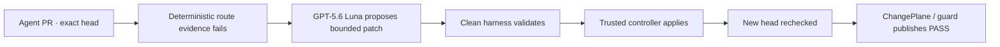

# ChangePlane

> **Keep GitHub. Let agents ship.**

Independent, exact-revision assurance for code written and repaired by AI agents.

ChangePlane is an OpenAI Build Week project in the **Developer Tools** track. Its operating principle is simple: **agents can propose and repair code; they should never certify themselves.** A proposal model may return a bounded unified diff. A deterministic harness validates the exact head, allowed paths, evidence, stale-head state, and attempt budget. Only a separately credentialed trusted controller may apply the accepted patch and publish `ChangePlane / guard` on the new exact head.

The public product is available at [changeplane.vercel.app](https://changeplane.vercel.app/). It opens a signed-out RouteThai assurance replay without repository access.

## Build Week submission summary

- **Track:** Developer Tools
- **One-liner:** Independent, exact-revision assurance for code written and repaired by AI agents.
- **Positioning:** Keep GitHub. Let agents ship.
- **Technical wedge:** model proposes; deterministic harness decides; trusted controller applies.
- **Default proposal model:** `gpt-5.6-luna`
- **Connected alternatives:** `gpt-5.6-terra`, `gpt-5.6-sol`
- **OpenAI API:** Responses API through native `fetch`, `reasoning.effort: "high"`, `store: false`
- **Primary use case:** RouteThai production-informed shadow pilot using only synthetic data
- **Public boundary:** recorded replay; no GitHub connection, live key field, or live model selector
- **Private boundary:** invite-only BYOK on one disposable canary repository
- **Production boundary:** observe-only; no managed spend, self-serve installation, production repair enforcement, or merge authority

Start with [JUDGE_GUIDE.md](JUDGE_GUIDE.md) for the 90-second evaluation path.

## What was built with Codex and GPT-5.6

Codex was used to inspect the existing architecture, migrate the provider boundary, implement runtime policy and GitHub APIs, preserve the established product design, create tests and competition documentation, run the live adapter canary, and verify the release.

GPT-5.6 Luna is not marketing copy in the UI. It is the default in the shared runtime contract, trusted policy, server validation, GitHub workflow template, BYOK verification, and live synthetic adapter canary. Terra and Sol use the same allowlisted adapter contract. DeepSeek remains as an unadvertised compatibility adapter and is not part of the Build Week experience.

### Build provenance

There were no repository commits before the Build Week eligibility window. The repository history begins during Build Week.

| Boundary | Date | Commit/evidence | Scope |
| --- | --- | --- | --- |
| Pre-competition baseline | Before July 13, 2026 | No repository commit | Product concept only; not submitted as implementation evidence |
| First repository provenance | July 19, 2026 | `b0191ea2ff832e60461f1f27c66e01a80c62eed9` | Initial launch provenance |
| Last baseline before this Build Week package | July 19, 2026 | `44edc14ec0f32aaf6db89e08a9ec3c2a23d1739e` | Observe canary and prior provider boundary |
| GPT-5.6 RouteThai adapter canary | July 20, 2026 | [`evidence/routethai-luna-adapter-canary.json`](evidence/routethai-luna-adapter-canary.json) | Live Luna request, bounded patch, clean apply, deterministic re-validation |
| Submission release | July 20, 2026 | Use the release commit shown by `GET /api/github?action=readiness` | Public RouteThai replay, OpenAI runtime, competition package |

Add the Codex Session ID from `/feedback` to the Devpost submission before final submission. The application cannot infer or fabricate that identifier.

## RouteThai sanitized shadow pilot

The public story is informed by a real startup operating production route-planning software, but it is **not connected to the RouteThai production repository**. All stop IDs, service windows, repository names, source files, timestamps, and evidence are synthetic. No customer, coordinate, map URL, production workbook, or private-repository screenshot is included.

The replay follows one event from beginning to end:

1. A coding agent changes a route-planning heuristic on exact head `71b04c2`.
2. Deterministic evidence finds one synthetic stop scheduled after its service window.
3. ChangePlane binds the failure and allowed routing path to the exact head.
4. GPT-5.6 Luna receives only the failure evidence and allowed-path source, then proposes a unified diff.
5. A clean validation job rejects stale heads, expanded paths, malformed patches, and exhausted attempts.
6. A separately credentialed trusted controller applies the accepted patch.
7. Fresh evidence passes on new exact head `9fc82a1`, and only then may `ChangePlane / guard` publish PASS.

The reusable synthetic fixture is in [`examples/routethai-synthetic`](examples/routethai-synthetic). The recorded live adapter result is in [`evidence/routethai-luna-adapter-canary.json`](evidence/routethai-luna-adapter-canary.json).

## Architecture and authority boundary



The model job receives no GitHub token, App private key, controller secret, push credential, merge permission, or Check authority. Provider output is treated as untrusted data and must pass the same patch-only validator as every compatibility adapter. A model cannot return PASS.

The public replay is intentionally not a technical dashboard. It is a complete, clickable explanation of this boundary. Connected onboarding remains GitHub App-first: connect GitHub, choose one repository, merge one setup PR. BYOK is optional after setup and never blocks observe onboarding.

## Shared runtime contract

The server, UI, workflow, and tests import one allowlist from [`src/lib/runtime.js`](src/lib/runtime.js):

```js
DEFAULT_PROPOSAL_MODEL = "gpt-5.6-luna"

SUPPORTED_PROPOSAL_MODELS = [
  "gpt-5.6-luna",
  "gpt-5.6-terra",
  "gpt-5.6-sol",
]
```

The repository-owned trusted policy is:

```json
{
  "runtime": {
    "funding": "byok",
    "provider": "openai",
    "secretName": "OPENAI_API_KEY",
    "model": "gpt-5.6-luna",
    "reasoningEffort": "high",
    "managedSubscription": "reserved"
  }
}
```

Runtime policy is read from the trusted default-branch checkout. Pull-request code cannot select the model for its own run. Unsupported model IDs are rejected before OpenAI or GitHub access. A connected model change creates a protected pull request that changes only `.changeplane.json`; it never writes directly to the default branch.

## OpenAI adapter

[`examples/changeplane-provider-openai.js`](examples/changeplane-provider-openai.js) uses native `fetch` against the Responses API. It sends:

- the model from trusted runtime policy;
- `reasoning: { "effort": "high" }`;
- `store: false`;
- exact failure evidence;
- source context only from allowed paths; and
- an instruction to return a unified diff only.

It fails closed on invalid credentials, unsupported models, provider refusal, timeout, oversized output, malformed JSON, incomplete output, empty patches, new files, deleted files, protected paths, or paths outside the grant. Provider errors never include upstream response bodies.

## GitHub and BYOK API

- `GET /api/github?action=byok&repository=owner/repo` returns only configuration state, provider, and active model.
- `POST /api/github?action=byok` verifies the selected OpenAI model, encrypts the key with GitHub's repository public key, and stores it only as `OPENAI_API_KEY`.
- `DELETE /api/github?action=byok` deletes only that Actions Secret. Runtime policy stays unchanged and repair fails closed.
- `POST /api/github?action=runtime` validates the model allowlist and creates an exact-base config PR limited to `.changeplane.json`.

Plaintext provider keys must never enter localStorage, logs, API responses, screenshots, or a ChangePlane database. API responses set a request ID and logs contain only structured redacted metadata.

## Local evaluation

Requirements: Node.js `>=22.18 <23`.

```sh
npm ci --cache .npm-cache
npm test
npm run build
```

Run the public product locally:

```sh
npm run dev
```

The signed-out root falls back to the RouteThai replay when the GitHub connector is absent or the hosted rollout is in controlled-canary mode.

Run the deliberately failing synthetic evidence:

```sh
node --test examples/routethai-synthetic/service-window.test.js
```

Run a live Luna adapter canary only after placing `OPENAI_API_KEY` in an ignored `.env.local` and exporting it into the process environment:

```sh
node scripts/run-openai-route-canary.mjs
```

The script makes one bounded proposal call, uses a temporary worktree, requires the original fixture to fail, validates the patch with `git apply --check`, requires the patched fixture to pass, prints redacted metadata only, and deletes the temporary worktree. Never commit `.env.local`.

## Controlled canary boundary

The only authorized live GitHub repair target is:

```text
LeChiffreVol2/changeplane-disposable-canary-20260719
```

Set both `CHANGEPLANE_CANARY_REPOSITORY` and `CHANGEPLANE_REPAIR_REPOSITORY` to that exact value. Every other repository route rejects before GitHub access. Never use a RouteThai repository as the canary target.

The inactive templates under [`examples`](examples) are not installed workflows. Files under `.github/workflows` remain limited to production CI. Keep both repair switches false until the App-signed attempt ledger, one-repository Contents-only push token, exact-head synchronize event, fresh recheck, and negative stale/path/provider/budget cases are observed in the disposable repository.

The current tracked adapter canary proves live Luna access, bounded patch parsing, clean apply, and deterministic re-validation. It does **not** prove the App-authored GitHub push or Check publication; that limitation is recorded in the evidence file and [JUDGE_GUIDE.md](JUDGE_GUIDE.md).

## Current limits

- Public execution is a recorded replay, not a browser-side model call.
- Connected BYOK and model settings are invite-only and single-repository.
- Observe mode cannot block merge or deploy.
- Managed model execution, metering, billing, and subscription checkout are disabled.
- Self-serve GitHub installation and new-install stages remain disabled for this release.
- Production repair enforcement is not enabled.
- GitHub.com and same-repository pull requests only.
- GitHub Merge Queue `merge_group` is not yet supported.
- No ChangePlane database, queue, billing service, CLI, TUI, proprietary agent runtime, merge service, or generalized provider framework.
- The DeepSeek compatibility adapter remains in source but is not selectable in the Build Week UI.

## Security, license, and notices

The source repository is public for product evaluation and transparency. It is source-visible, not open source, and remains proprietary/`UNLICENSED`. The limited judging license is in [EVALUATION_LICENSE.md](EVALUATION_LICENSE.md). Dependency notices are in [THIRD_PARTY_NOTICES.md](THIRD_PARTY_NOTICES.md). Security reporting and operational controls are in [SECURITY.md](SECURITY.md), [`docs/production-runbook.md`](docs/production-runbook.md), and [`docs/release-checklist.md`](docs/release-checklist.md).

The RouteThai name is used with the project owner's stated authorization solely to identify the sanitized shadow pilot. No third-party customer endorsement or production integration is claimed.
