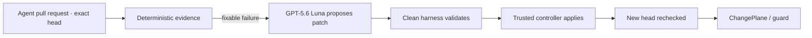

# ChangePlane

> **Keep GitHub. Let agents ship.**

Independent, exact-revision assurance for code written and repaired by AI agents.

ChangePlane sits between an agent-authored pull request and the GitHub Check that teams trust. A model may propose a bounded patch. A deterministic harness decides whether the patch is valid. A separately credentialed controller applies it. Only fresh evidence on the new exact head may publish `ChangePlane / guard`.

[Install ChangePlane on GitHub](https://changeplane.vercel.app/) or [open the RouteThai example](https://changeplane.vercel.app/) without signing in.

## What ChangePlane does

The normal path runs without a per-pull-request dashboard or manual handoff:

1. Bind the pull request's exact head, changed paths, title, and one meaningful behavioral Check.
2. Evaluate deterministic evidence from the trusted repository configuration.
3. Return a fixable failure to GPT-5.6 Luna for a bounded patch proposal.
4. Reject malformed, stale, protected, expanded, or exhausted work in a clean validation job.
5. Let a trusted controller apply an accepted patch with one short-lived, exact-repository credential.
6. Re-run evidence on the new head and publish `ChangePlane / guard` only if it passes.

Protected, ambiguous, stale, provider-failed, or exhausted work stops for a human. GitHub remains the forge, branch-policy surface, and merge authority.



The proposal job receives no GitHub token, App private key, controller secret, push credential, approval authority, merge permission, or Check authority. A model cannot return `PASS`.

## Install on GitHub

Hosted onboarding needs no CLI, database, ChangePlane account provisioning, or Vercel configuration:

1. Select **Install ChangePlane on GitHub**.
2. On GitHub, choose a personal account or organization and grant the repository-scoped App access only to the intended repositories.
3. Return to ChangePlane and choose one writable repository from an installation visible to the signed-in user.
4. Complete the read-only safety preflight.
5. Bind one existing behavioral Check and its publisher for autonomous assurance, or deliberately choose scope-only observe mode.
6. Optionally provide a repository BYOK OpenAI key for model-backed review and repair. ChangePlane verifies it, encrypts it with GitHub's repository public key, stores only `OPENAI_API_KEY` as an Actions Secret, and clears the field.
7. Review and merge the single protected setup pull request. Automation remains inert until GitHub reports that pull request merged.

Autonomous mode requires the repository-scoped App, an exact behavioral Check and expected publisher, verified repository BYOK, and the reviewed managed setup. Every missing gate fails closed. Scope-only observe mode never dispatches repair and does not block merge or deploy.

### Supported platforms

- GitHub.com personal accounts and organizations, including Enterprise Cloud organizations.
- Same-repository pull requests.
- GitHub Merge Queue for exact-revision guard evaluation only.
- Current desktop and mobile browsers for onboarding and the public example.
- Node.js `>=22.18 <23` for local verification.

GitHub Enterprise Server, GitLab, Bitbucket, fork pull requests, cross-repository repair, managed model billing, and automatic merge are not supported in this release.

## Hosted service and Vercel

Customers use the hosted product at [changeplane.vercel.app](https://changeplane.vercel.app/). They do not deploy this repository to Vercel, connect a Vercel account to ChangePlane, or share Vercel credentials.

If a connected repository already publishes previews through Vercel's GitHub integration, ChangePlane may include the existing preview in its receipt only when the corresponding GitHub Deployment SHA exactly matches the evaluated pull-request head. ChangePlane does not host the preview and does not require access to the customer's Vercel account.

GitHub-writing API routes in the hosted service require an attributed Vercel Production deployment from this repository's protected `main` branch. Fork deployments, CLI uploads, previews, and deployments without verified Git provenance fail closed before GitHub or OpenAI access. Self-hosting and commercial operation of this source are not licensed or supported.

See [Hosted service boundary](docs/hosted-service.md) for the operator and customer trust model.

## Product controls

- **Exact-revision guard.** Every contract, receipt, grant, review, preview, and decision is bound to one commit SHA. A new commit invalidates the prior assurance.
- **Independent review.** `ChangePlane / review` may publish up to five validated findings on changed lines. It is advisory and cannot approve, repair, certify, or contribute to PASS.
- **Repository assurance memory.** `.changeplane/assurance.md` stores reviewed invariants beside the code. It guides review but is never behavioral evidence.
- **Bounded autonomous repair.** A campaign allows at most two attempts within one immutable 15-minute budget. Tests, evidence configuration, dependency manifests, managed files, and repository-protected paths require human review.
- **Agent handback.** GitHub-native receipts can return bounded findings to Codex, Cursor, Claude Code, Trae, Copilot, OpenSWE, or another coding agent without granting it controller authority.
- **Preview binding.** Existing GitHub Deployment and Vercel preview URLs are shown only when their deployment SHA matches the evaluated head.
- **Merge Queue guard.** A `merge_group` is evaluated as its own revision. Queue runs never dispatch review, proposal, repair, apply, or handback work.

## Runtime contract

The server, UI, workflow, and tests share one model policy from [`src/lib/runtime.js`](src/lib/runtime.js):

```js
DEFAULT_PROPOSAL_MODEL = "gpt-5.6-luna"

SUPPORTED_PROPOSAL_MODELS = [
  "gpt-5.6-luna",
  "gpt-5.6-terra",
  "gpt-5.6-sol",
]
```

The trusted repository policy keeps model selection and repair limits auditable:

```json
{
  "harness": {
    "mode": "autonomous",
    "maxAttempts": 2,
    "budgetMinutes": 15
  },
  "runtime": {
    "funding": "byok",
    "provider": "openai",
    "secretName": "OPENAI_API_KEY",
    "model": "gpt-5.6-luna",
    "reasoningEffort": "high",
    "managedSubscription": "reserved"
  }
}
```

Policy is read only from the trusted default branch. Pull-request code cannot select the model, increase the attempt budget, or expand authority for its own run. Model changes create a protected configuration pull request limited to `.changeplane.json`.

The OpenAI adapter uses native `fetch` with the Responses API, `reasoning.effort: "high"`, `store: false`, exact failure evidence, allowed-path source context only, and a strict structured patch field. Unsupported models, refusal, timeout, oversized or malformed output, non-patch output, protected paths, and clean-validation failures are rejected before repository mutation. Compatibility adapters remain outside the supported product UI.

## RouteThai production use

ChangePlane is used and tested with RouteThai's real production workflow. That private installation validates the product against production constraints while keeping the repository, routing data, customer context, and operating details private.

The signed-out RouteThai workspace is a sanitized replay of the same assurance pattern. Every public stop ID, service window, repository name, source file, timestamp, and evidence value is synthetic. It makes no request to RouteThai production systems and contains no customer name, coordinate, map URL, production workbook, private-repository screenshot, or operating data.

The reusable fixture is under [`examples/routethai-synthetic`](examples/routethai-synthetic). Redacted live evidence is under [`evidence`](evidence).

## Local verification

Requirements: Node.js `>=22.18 <23`.

```sh
npm ci --cache .npm-cache
npm run verify
npm run test:e2e
npm run audit:prod
```

Run the signed-out product surface locally:

```sh
npm run dev
```

The RouteThai fixture intentionally begins in a failing state:

```sh
node --test examples/routethai-synthetic/service-window.test.js
```

For the fastest evaluation path, use [EVALUATION.md](EVALUATION.md). A live adapter canary is optional and requires an operator-owned `OPENAI_API_KEY` with access to `gpt-5.6-luna`; never paste a provider key into chat, an issue, a log, a screenshot, or source control.

## Built with Codex and GPT-5.6

Codex was the implementation and verification partner across the OpenAI adapter, GitHub App and BYOK onboarding, autonomous controller boundary, fail-closed tests, browser journeys, production canary, and release evidence. The product owner retained the authority model, product scope, production-data boundary, and release decisions.

GPT-5.6 Luna is the real default for bounded patch proposals and advisory review, not a display-only selection. Terra and Sol use the same allowlisted contract. The model proposes from bounded evidence; it never validates its own patch, writes to GitHub, publishes a required Check, or decides PASS.

The complete OpenAI Build Week implementation record—including dates, commit hashes, canary evidence, the Codex `/feedback` Session ID, and the exact evaluation path—is isolated in [docs/build-week.md](docs/build-week.md).

## Trust and operations

- [Security policy](SECURITY.md)
- [Data handling](docs/data-handling.md)
- [Production runbook](docs/production-runbook.md)
- [Release checklist](docs/release-checklist.md)
- [Support](SUPPORT.md)
- [Third-party notices](THIRD_PARTY_NOTICES.md)

ChangePlane does not claim autonomous merge, managed model execution, zero data retention, SOC 2, GDPR compliance, 24/7 support, or unmeasured enterprise scale.

## License

Copyright © 2026 ChangePlane. All rights reserved.

The source is publicly visible but proprietary and `UNLICENSED`. Public visibility does not grant permission to copy, deploy, modify, redistribute, or operate it. Competition evaluators receive only the limited rights in [EVALUATION_LICENSE.md](EVALUATION_LICENSE.md). Third-party dependencies retain their own licenses.
