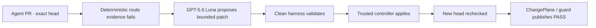

# ChangePlane

> **Keep GitHub. Let agents ship.**

Independent, exact-revision assurance for code written and repaired by AI agents.

ChangePlane is an OpenAI Build Week project in the **Developer Tools** track. Its operating principle is simple: **agents can propose and repair code; they should never certify themselves.** A proposal model may return a bounded unified diff. A deterministic harness validates the exact head, allowed paths, evidence, stale-head state, and attempt budget. Only a separately credentialed trusted controller may apply the accepted patch and publish `ChangePlane / guard` on the new exact head.

The public product is available at [changeplane.vercel.app](https://changeplane.vercel.app/). Install the repository-scoped GitHub App on a personal account or organization, choose one repository, bind one meaningful GitHub test, save your own OpenAI key directly to GitHub Actions, and merge one autonomous-harness setup pull request. A signed-out RouteThai assurance replay remains available without repository access.

## Build Week submission summary

- **Track:** Developer Tools
- **One-liner:** Independent, exact-revision assurance for code written and repaired by AI agents.
- **Positioning:** Keep GitHub. Let agents ship.
- **Technical wedge:** model proposes; deterministic harness decides; trusted controller applies.
- **Default proposal model:** `gpt-5.6-luna`
- **Connected alternatives:** `gpt-5.6-terra`, `gpt-5.6-sol`
- **OpenAI API:** Responses API through native `fetch`, `reasoning.effort: "high"`, `store: false`
- **Primary use case:** RouteThai production-informed shadow pilot using only synthetic data
- **Public boundary:** self-serve autonomous onboarding plus a signed-out recorded replay
- **BYOK boundary:** required for autonomous proposals and stored only as a per-repository GitHub Actions Secret
- **Review boundary:** `ChangePlane / review` is exact-diff, advisory evidence; it never certifies, approves, or publishes PASS
- **Repair boundary:** two attempts within one immutable 15-minute campaign; protected, ambiguous, stale, provider-failed, or exhausted cases stop for a human
- **Production boundary:** no managed spend, direct default-branch write, model-held forge credential, or merge authority

Start with [JUDGE_GUIDE.md](JUDGE_GUIDE.md) for the 90-second evaluation path. Product and competitive priorities are in [PRODUCT_STRATEGY.md](PRODUCT_STRATEGY.md).

## What was built with Codex and GPT-5.6

Codex was used to inspect the existing architecture, migrate the provider boundary, implement runtime policy and GitHub APIs, preserve the established product design, create tests and competition documentation, run the live adapter canary, and verify the release.

GPT-5.6 Luna is not marketing copy in the UI. It is the default in the shared runtime contract, trusted policy, server validation, GitHub workflow template, BYOK verification, and live synthetic adapter canary. Terra and Sol use the same allowlisted adapter contract. DeepSeek remains as an unadvertised compatibility adapter and is not part of the Build Week experience.

### Build provenance

There were no repository commits before the Build Week eligibility window. The repository history begins during Build Week.

| Boundary | Date | Commit/evidence | Scope |
| --- | --- | --- | --- |
| Pre-competition baseline | Before July 13, 2026 | No repository commit | Product concept only; not submitted as implementation evidence |
| First repository provenance | July 19, 2026 | `b0191ea2ff832e60461f1f27c66e01a80c62eed9` | Initial launch provenance |
| Last baseline before this Build Week package | July 19, 2026 | `44edc14ec0f32aaf6db89e08a9ec3c2a23d1739e` | Observe canary and prior provider boundary |
| GPT-5.6 RouteThai adapter canary | July 20, 2026 | [`evidence/routethai-luna-adapter-canary.json`](evidence/routethai-luna-adapter-canary.json) | Live Luna request, bounded patch, clean apply, deterministic re-validation |
| Autonomous GitHub canary | July 20, 2026 | [`evidence/routethai-luna-github-canary.json`](evidence/routethai-luna-github-canary.json) | Live Luna proposal, signed ledger, clean apply, App-authored push, fresh exact-head PASS |
| Autonomous runtime hardening | July 20, 2026 | `0e8e093262a175d8ffa8284106c0c62ed2f68f65` | Public RouteThai replay, self-serve GitHub/BYOK, autonomous harness, duplicate-trigger hardening |
| Assurance plane and managed v7 | July 20, 2026 | [`PR #32`](https://github.com/LeChiffreVol2/changeplane/pull/32) | Independent review, assurance memory, agent handback, exact-head preview contract, and `merge_group` guard contract |
| Luna raw-diff hardening and managed v8 | July 20, 2026 | [`PR #34`](https://github.com/LeChiffreVol2/changeplane/pull/34) | Live fail-closed canary finding converted into a strict `^diff --git ` Structured Outputs constraint |
| Redacted provider evidence and managed v9 | July 20, 2026 | [`PR #35`](https://github.com/LeChiffreVol2/changeplane/pull/35) · [`evidence/changeplane-v9-production-release.json`](evidence/changeplane-v9-production-release.json) | Production release plus live Luna request metadata, clean validation, App-authored repair, synchronize event, and new-head PASS |
| Submission release | July 20, 2026 | Use the exact commit returned by `GET /api/github?action=readiness` | Competition package; may advance for evidence-only documentation commits |

Add the Codex Session ID from `/feedback` to the Devpost submission before final submission. The application cannot infer or fabricate that identifier.

## RouteThai sanitized shadow pilot

The public story is informed by a real startup operating production route-planning software, but it is **not connected to the RouteThai production repository**. All stop IDs, service windows, repository names, source files, timestamps, and evidence are synthetic. No customer, coordinate, map URL, production workbook, or private-repository screenshot is included.

The replay follows one event from beginning to end:

1. A coding agent changes a route-planning heuristic on exact head `71b04c2`.
2. Deterministic evidence finds one synthetic stop scheduled after its service window.
3. ChangePlane binds the failure and allowed routing path to the exact head.
4. GPT-5.6 Luna receives only the failure evidence and allowed-path source, then proposes a unified diff.
5. A clean validation job rejects stale heads, expanded paths, malformed patches, and exhausted attempts.
6. A separately credentialed trusted controller applies the accepted patch.
7. Fresh evidence passes on new exact head `9fc82a1`, and only then may `ChangePlane / guard` publish PASS.

The reusable synthetic fixture is in [`examples/routethai-synthetic`](examples/routethai-synthetic). The recorded adapter result is in [`evidence/routethai-luna-adapter-canary.json`](evidence/routethai-luna-adapter-canary.json), the first full disposable-repository run is in [`evidence/routethai-luna-github-canary.json`](evidence/routethai-luna-github-canary.json), and the managed-v9 production release and final canary are in [`evidence/changeplane-v9-production-release.json`](evidence/changeplane-v9-production-release.json).

## Architecture and authority boundary



The model job receives no GitHub token, App private key, controller secret, push credential, merge permission, or Check authority. Provider output is treated as untrusted data and must pass the same patch-only validator as every compatibility adapter. A model cannot return PASS.

The public replay is intentionally not a technical dashboard. It is a complete, automatically running explanation of this boundary. Connected onboarding is GitHub App-first: connect GitHub, choose one repository from any eligible personal or organization installation, bind one exact behavioral check, save BYOK directly to GitHub, and merge one setup PR. Scope-only users remain in observe mode; autonomous mode never activates without both the check and provider key.

## Product surface

ChangePlane keeps the daily workflow in GitHub and adds five repository-native controls:

- **Independent review plane.** When repository BYOK is configured, GPT-5.6 may publish up to five validated, deduplicated findings on changed lines as `ChangePlane / review`. The review is advisory and exact-head bound. It cannot approve, repair, certify, or affect `ChangePlane / guard`.
- **Assurance memory.** `.changeplane/assurance.md` stores reviewed repository invariants and [policy-pack guidance](examples/assurance-policy-packs) beside the code. It is read only from the trusted default branch and guides review; it is context, never proof.
- **Agent handback.** A vendor-neutral, machine-readable GitHub payload returns bounded findings through the Action output and exact-head receipt comment. Any coding agent can consume it without agent-specific write authority.
- **Exact-head preview binding.** Change receipts include an existing GitHub Deployment or Vercel preview only after its deployment SHA matches the evaluated head. ChangePlane does not host previews.
- **Merge Queue guard.** `merge_group` is evaluated as its own exact revision and receives `ChangePlane / guard`. Queue evaluation never dispatches repair or a model review; GitHub remains the merge authority.

## Shared runtime contract

The server, UI, workflow, and tests import one allowlist from [`src/lib/runtime.js`](src/lib/runtime.js):

```js
DEFAULT_PROPOSAL_MODEL = "gpt-5.6-luna"

SUPPORTED_PROPOSAL_MODELS = [
  "gpt-5.6-luna",
  "gpt-5.6-terra",
  "gpt-5.6-sol",
]
```

The repository-owned trusted policy includes the bounded harness and runtime:

```json
{
  "harness": {
    "mode": "autonomous",
    "maxAttempts": 2,
    "budgetMinutes": 15
  },
  "review": {
    "mode": "advisory",
    "maxFindings": 5,
    "memoryPath": ".changeplane/assurance.md"
  },
  "runtime": {
    "funding": "byok",
    "provider": "openai",
    "secretName": "OPENAI_API_KEY",
    "model": "gpt-5.6-luna",
    "reasoningEffort": "high",
    "managedSubscription": "reserved"
  }
}
```

Runtime and harness policy are read from the trusted default-branch checkout. Pull-request code cannot select the model or expand authority for its own run. Unsupported model IDs and expanded budgets are rejected before OpenAI or GitHub access. A connected model or harness change creates a protected pull request that changes only `.changeplane.json`; it never writes directly to the default branch.

## OpenAI adapter

[`examples/changeplane-provider-openai.js`](examples/changeplane-provider-openai.js) uses native `fetch` against the Responses API. It sends:

- the model from trusted runtime policy;
- `reasoning: { "effort": "high" }`;
- `store: false`;
- exact failure evidence;
- source context only from allowed paths; and
- an official Responses API `text.format` JSON schema with one required `patch` field.

The schema requires the patch string to begin with `diff --git `; the adapter then extracts only that field and passes it to the unchanged unified-diff and allowed-path validator. It fails closed on invalid credentials, unsupported models, provider refusal, timeout, oversized output, malformed JSON or schema, incomplete output, empty patches, new files, deleted files, protected paths, paths outside the grant, clean-apply failure, or failed deterministic re-validation. Successful provider metadata records only the allowlisted model, completed/incomplete state, and a bounded request ID; prompts, patches, response bodies, and credentials are never logged. See OpenAI's [Responses API structured-output definition](https://developers.openai.com/api/docs/guides/migrate-to-responses#6-update-structured-outputs-definitions).

## GitHub and BYOK API

The GitHub App supports GitHub.com personal accounts and organizations, including Enterprise Cloud organizations. A returning user may select repositories across multiple eligible App installations. Repository access remains installation-scoped; GitHub Enterprise Server is not supported in this release.

- `GET /api/github?action=byok&repository=owner/repo` returns only configuration state, provider, and active model.
- `POST /api/github?action=byok` verifies the selected OpenAI model, encrypts the key with GitHub's repository public key, and stores it only as `OPENAI_API_KEY`.
- `DELETE /api/github?action=byok` deletes only that Actions Secret. Runtime policy stays unchanged and repair fails closed.
- `POST /api/github?action=runtime` validates the model and harness allowlists, then creates an exact-base config PR limited to `.changeplane.json`.

Plaintext provider keys must never enter localStorage, logs, API responses, screenshots, or a ChangePlane database. API responses set a request ID and logs contain only structured redacted metadata.

## Local evaluation

Requirements: Node.js `>=22.18 <23`.

```sh
npm ci --cache .npm-cache
npm test
npm run build
```

Run the public product locally:

```sh
npm run dev
```

The signed-out root offers GitHub connection when self-serve is enabled and always keeps the RouteThai example available. It falls back to the example-only entry when the connector is absent or the hosted rollout is in controlled-canary mode.

Run the deliberately failing synthetic evidence:

```sh
node --test examples/routethai-synthetic/service-window.test.js
```

Run a live Luna adapter canary only after placing `OPENAI_API_KEY` in an ignored `.env.local` and exporting it into the process environment:

```sh
node scripts/run-openai-route-canary.mjs
```

The script makes one bounded proposal call, uses a temporary worktree, requires the original fixture to fail, validates the patch with `git apply --check`, requires the patched fixture to pass, prints redacted metadata only, and deletes the temporary worktree. Never commit `.env.local`.

## Autonomous harness boundary

The disposable live GitHub repair target is:

```text
LeChiffreVol2/changeplane-disposable-canary-20260719
```

Never use a RouteThai repository as the canary target. The RouteThai fixture is synthetic and may be copied into the disposable repository only.

The self-serve setup PR vendors the small Action, harness policy reader, advisory review helper, repair helpers, workflows, and starter assurance memory into the selected repository. No ChangePlane queue, database, proprietary workspace, merge service, or model-held GitHub credential is added. Repository secrets begin inert; the controller derives a repository-bound HMAC, publishes the App verification key ring, and enables repair only after GitHub App scope, BYOK, and the exact behavioral check are verified.

The tracked adapter canary proves live Luna access, structured patch extraction, bounded-path parsing, clean apply, and deterministic re-validation. The managed-v9 disposable GitHub canary additionally proves redacted provider request metadata, the App-signed attempt ledger, one-time exact-repository push credential, App-authored repair commit, fresh `pull_request` synchronization, and PASS on only the repaired exact head. The live malformed-format canary stopped before apply, and stale-head, replay, path expansion, provider failure, and budget exhaustion remain fail-closed in the controller test suite. Exact-preview and `merge_group` contracts are automated; positive live evidence requires an eligible deployment and Merge Queue repository.

## Current limits

- The signed-out RouteThai workspace is a recorded replay, not a browser-side model call. Connected repositories execute live only after the owner merges the reviewed setup pull request.
- BYOK is configured per repository after GitHub connection; it is not stored by ChangePlane.
- Observe mode cannot block merge or deploy.
- Managed model execution, metering, billing, and subscription checkout are disabled.
- GitHub Enterprise Server is not supported; self-serve onboarding targets GitHub.com personal accounts, organizations, and Enterprise Cloud.
- Autonomous repair requires a repository-scoped GitHub App installation, one exact behavioral check, BYOK, and the managed harness setup PR.
- ChangePlane publishes a Check but does not merge; repositories choose whether to require that Check through GitHub rulesets.
- GitHub.com and same-repository pull requests only.
- GitHub Merge Queue is supported for exact-`merge_group` guard evaluation only. Queue runs never dispatch repair or model review. Positive live queue evidence is not captured because the private personal-account canary is not eligible for Merge Queue.
- Independent review runs only when repository BYOK is configured, is advisory, and never contributes PASS.
- No ChangePlane database, queue, billing service, CLI, TUI, proprietary agent runtime, merge service, or generalized provider framework.
- The DeepSeek compatibility adapter remains in source but is not selectable in the Build Week UI.

## Security, license, and notices

The source repository is public for product evaluation and transparency. It is source-visible, not open source, and remains proprietary/`UNLICENSED`. The limited judging license is in [EVALUATION_LICENSE.md](EVALUATION_LICENSE.md). Dependency notices are in [THIRD_PARTY_NOTICES.md](THIRD_PARTY_NOTICES.md). Security reporting and operational controls are in [SECURITY.md](SECURITY.md), [`docs/production-runbook.md`](docs/production-runbook.md), and [`docs/release-checklist.md`](docs/release-checklist.md).

The RouteThai name is used with the project owner's stated authorization solely to identify the sanitized shadow pilot. No third-party customer endorsement or production integration is claimed.
