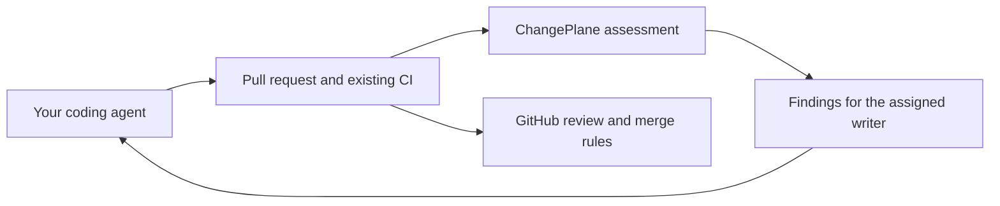

# ChangePlane

**Keep GitHub. Let agents ship.**

ChangePlane helps individual developers and teams work with coding agents in their existing GitHub repositories. It checks whether CI results apply to the current pull request revision and returns actionable findings to the writer. Optional coordination gives parallel tasks separate worktrees, tracks dependencies, and follows their review and CI outcomes.

[](https://github.com/LeChiffreVol2/changeplane/actions/workflows/ci.yml)
[](LICENSE)

**Open source · free for individual and commercial use · no ChangePlane account or model key required.**

[Quickstart](#try-it-in-one-minute) · [Releases](https://github.com/LeChiffreVol2/changeplane/releases) · [Documentation](docs/community.md) · [Contributing](CONTRIBUTING.md) · [Security](SECURITY.md)

## Choose how you work

| | Start here | Add when needed |
| --- | --- | --- |
| **Individual** | [Inspect a pull request](#inspect-a-real-pull-request) with read-only access | [Coordinate multiple agents](docs/team-operator.md) working on your own features |
| **Teams** | [Set up a shared repository](docs/team-operator.md) with scoped tasks and separate worktrees | Dependencies, assigned feedback and a scheduled observer |

Both paths support personal and organization repositories, subject to repository permissions. Use your existing coding agents and GitHub review process.

The [website](https://changeplane.vercel.app/) includes **Settings** for Individual and Teams. Individual starts with read-only assessment; parallel agents are optional. Settings prepare a local configuration draft for a reviewed pull request. They do not install or change a repository. See the [settings guide](docs/community.md#settings-for-individual-and-teams).

## Try it in one minute

Requires Git and Node.js 22.18+; Node 22 and 24 are tested.

```sh
git clone https://github.com/LeChiffreVol2/changeplane.git
cd changeplane
node community/cli.js evaluate examples/community/satisfied.json
```

The command prints a JSON assessment with `decision: "EVIDENCE_SATISFIED"` and exits 0. Once cloned, the included examples run entirely offline, with no npm installation or model call.

Try the failure cases:

```sh
node community/cli.js evaluate examples/community/failed.json
node community/cli.js evaluate examples/community/stale.json
```

| Example | Decision | Exit code |
| --- | --- | --- |
| `satisfied.json` | `EVIDENCE_SATISFIED` | 0 |
| `failed.json` | `REVIEW_REQUIRED` | 1 |
| `stale.json` | `BLOCKED` | 1 |

These are synthetic inputs for learning the report format. Exit 2 indicates invalid or unavailable input. Run `node community/cli.js --help` for all commands.

Prefer an archive? Download the dependency-free bundle and verify its SHA-256 against `SHA256SUMS` from the same [release](https://github.com/LeChiffreVol2/changeplane/releases). The commands above work inside the extracted directory.

## Inspect a real pull request

1. Choose an existing CI job that tests meaningful product behavior. Identify its exact job name, publisher and workflow path.
2. Add a reviewed `.changeplane.json` to the repository's default branch using the [example policy](examples/community/policy.json). Replace `Behavior` and the workflow path with your job's values. Preserve any existing policy and protected paths.
3. Let CI complete on a pull request targeting that default branch, then run:

```sh
node community/cli.js inspect YOUR_ACCOUNT/YOUR_REPOSITORY 123
```

Replace the repository and PR number with yours. Public repositories can use unauthenticated GitHub API access within its rate limit. For private access, supply `GH_TOKEN` or `GITHUB_TOKEN` through your environment or secret manager with **Contents, Pull requests, Checks and Actions read** permissions. Keep tokens out of command arguments and source files; organization approval or SSO may apply.

The report includes the observed revision, findings and a next action. The reader uses GitHub API reads, executes no PR code and publishes no Checks or comments. See the [complete setup and troubleshooting guide](docs/community.md).

## Use it in your workflow

**GitHub Actions:** add the release's pinned `changeplane-community.yml` through a configuration PR. It assesses PRs after your existing CI workflow completes, using read-only permissions and no repository checkout. [Action setup →](docs/community.md#run-in-github-actions)

**Parallel agents:** follow the [operator setup](docs/team-operator.md), then check configuration and current assigned work:

```sh
node community/cli.js team doctor YOUR_ACCOUNT/YOUR_REPOSITORY
node community/cli.js team next YOUR_ACCOUNT/YOUR_REPOSITORY
```

Each task has a defined scope and its own worktree. Existing agents perform development and respond to findings; ChangePlane records coordination in the repository. Doctor reports setup problems without changing branches. A stopped agent still needs its existing runtime to resume it.

**MCP clients:** the [stdio MCP server](docs/repository-team.md#cursor-and-other-mcp-clients) exposes the same task, worktree, diagnostic and feedback operations to compatible agents. Follow the operator credential-isolation requirements and [agent task loop](examples/changeplane-team-agent.md). One developer can use several agents through the same coordination engine as a team.

## How it works


```mermaid
flowchart LR
  A[Your coding agent] --> B[Pull request and existing CI]
  B --> C[ChangePlane assessment]
  C --> D[Findings for the assigned writer]
  D --> A
  B --> E[GitHub review and merge rules]
```

ChangePlane reads policy from the trusted default branch and binds findings to the observed PR revision and CI execution. New commits or workflow attempts require fresh evidence. Changes to tests, workflows, manifests and protected paths remain subject to human review.

The evaluator is deterministic. Reports are advisory; they do not publish `ChangePlane / guard` or grant source-write, approval or merge authority. GitHub remains responsible for integration. Parallel path reservations coordinate participating writers; they cannot prove that separate features have no behavioral conflicts.

The open-source CLI, Action and MCP server use Node built-ins. Reports stay in your environment or CI, and coordination history stays in your repository. There is no automatic ChangePlane telemetry, database requirement or managed model spend. Your CI and coding-agent providers retain their own usage costs and data policies.

[Architecture](docs/automated-sdlc-architecture.md) · [Coordination design](docs/repository-team.md) · [Data and uninstall](docs/community.md#uninstall-and-data)

## Supported scope

| Capability | Current scope |
| --- | --- |
| Offline assessment | Release archives tested on Linux, macOS and Windows with Node 22 and 24 |
| GitHub assessment and coordination | GitHub.com personal and organization repositories; same-repository PRs targeting the default branch |
| Fork PRs and GitLab.com | Read-only collectors with synthetic test coverage; live installation qualification is incomplete; no coordination writes |
| MCP and Cursor | Stdio protocol tested; live Cursor installation and native Origin remain unqualified |
| Guard publication and automatic source repair | Outside the supported open-source installation; GitHub owns merge |

Enterprise Cloud access follows organization rules. GitHub Enterprise Server, self-managed GitLab and cross-repository repair require separate qualification. See [platform boundaries](docs/recovery-core.md), [operating limits](docs/community.md#limits-and-troubleshooting) and [QA evidence](docs/open-source-qa-audit.md).

## Releases and upgrades

Use [tagged releases](https://github.com/LeChiffreVol2/changeplane/releases) for a reproducible installation. `main` may contain improvements made after the latest tagged release; published assets and pinned Actions remain immutable. Read the [upgrade guide](docs/team-operator.md#upgrade-existing-installations) before changing existing operators or workflow pins.

## Develop and contribute

Full application development uses Node.js `>=22.18 <23`:

```sh
npm ci
npm run verify
npm run test:e2e
```

See [CONTRIBUTING.md](CONTRIBUTING.md) for the directory map and focused tests. Report bugs with a redacted reproduction through [GitHub Issues](https://github.com/LeChiffreVol2/changeplane/issues); report vulnerabilities through [SECURITY.md](SECURITY.md). [Support details](SUPPORT.md).

## License

[Apache License 2.0](LICENSE), for individual and commercial use. See [third-party notices](THIRD_PARTY_NOTICES.md). Software licensing does not grant hosted-service access or trademark rights.
