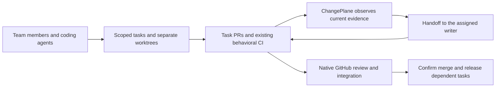

# ChangePlane

**Keep GitHub. Let agents ship.**

Open-source repository coordination for teams developing with coding agents. Give each task its own worktree, return PR and CI findings to its owner, and integrate through GitHub’s existing rules.

Start with [parallel repository coordination](docs/repository-team.md): scoped task reservations, dependencies, isolated Git worktrees and revision-bound PR/CI handoffs, available through the CLI and an MCP server. Coding agents perform source work; GitHub controls integration. Deployment integrations are deferred.

[](https://github.com/LeChiffreVol2/changeplane/actions/workflows/ci.yml)
[](LICENSE)

**Open Source · free for individuals and businesses · no model key · no ChangePlane account.**

[Get started](docs/community.md) · [Releases](https://github.com/LeChiffreVol2/changeplane/releases) · [How it works](#how-it-works) · [Contribute](CONTRIBUTING.md) · [Security](SECURITY.md)

## Try it in one minute

With Git and Node.js 22.18+:

```sh
git clone https://github.com/LeChiffreVol2/changeplane.git
cd changeplane
node community/cli.js evaluate examples/community/satisfied.json
node community/cli.js evaluate examples/community/failed.json
node community/cli.js evaluate examples/community/stale.json
```

No `npm install`, database, model call, or network access is needed for these three synthetic assessments. Expect `EVIDENCE_SATISFIED` (exit 0), `REVIEW_REQUIRED` (exit 1), and `BLOCKED` (exit 1). Exit 2 means invalid or unavailable input.

Prefer an archive? Download the dependency-free bundle and verify its SHA-256 from the [release assets](https://github.com/LeChiffreVol2/changeplane/releases). The same commands work inside it.

## Inspect a real pull request

First add a reviewed `.changeplane.json` policy to your repository's default branch using the [setup guide](docs/community.md#inspect-your-repository). Bind an existing behavioral CI job by its exact name, publisher and workflow path. Then:

```sh
node community/cli.js inspect YOUR_ACCOUNT/YOUR_REPOSITORY 123
```

For private repositories, set `GH_TOKEN` or `GITHUB_TOKEN` in your environment with read-only Contents, Pull requests, Checks and Actions access. Never pass a token on the command line. The CLI contacts only GitHub's API; it does not download source blobs, run PR code, publish Checks, write comments, or call ChangePlane.

Use the [read-only GitHub Action](docs/community.md#run-in-github-actions) for continuous assessments after your existing CI completes. No checkout, model key or App installation is needed. Its machine-readable output carries the exact revision, findings and an advisory handback for your existing coding agent.

## How it works


```mermaid
flowchart LR
  A[Team members and coding agents] --> B[Scoped tasks and separate worktrees]
  B --> C[Task PRs and existing behavioral CI]
  C --> D[ChangePlane observes current evidence]
  D --> E[Handoff to the assigned writer]
  E --> C
  C --> F[Native GitHub review and integration]
  F --> G[Confirm merge and release dependent tasks]
```

- **Shared deterministic evaluator.** The same scope, protected-path and evidence rules used by the hosted product; no model judges its own patch.
- **Fresh evidence.** A later workflow run or attempt supersedes older success, even on the same commit. Head, trusted policy revision and evidence are checked again before a live report is returned.
- **Protected evidence.** Tests, workflows, manifests and declared protected paths require human review, including renames out of protected directories.
- **Agent-neutral handback.** JSON findings name one exact revision. Codex, Cursor, Claude Code, Copilot or another agent can consume them as data. No native agent integration is implied.
- **Small operating footprint.** The CLI, Action and team MCP server use Node built-ins and the existing evaluator. Offline assessment has no external requests. Assessment readers use bounded GET requests; opt-in teamwork writes only its repository coordination branch.

An `EVIDENCE_SATISFIED` assessment means the declared inputs matched the checks at observation time. It does not prove the software has no defects. A snapshot supplied by a caller is unauthenticated. Neither an assessment nor a green assessment workflow is an App-owned `ChangePlane / guard`, Strict Head, or permission to merge.

## Choose the right surface

| | Open Source — available | Hosted service — controlled canary |
| --- | --- | --- |
| Local and read-only GitHub assessment | Yes | Shared evaluator |
| Personal and organization repositories | Yes, with appropriate read access | Customer activation closed |
| Model key / ChangePlane account | Neither required | Verify needs no model key |
| App-owned Guard and Strict Head | No | Implemented; customer qualification incomplete |
| Parallel task coordination | CLI, worktrees, assigned handoffs and MCP | Use the open-source operator |
| Automatic repair / merge | Existing agent handles recovery; GitHub controls merge | Repair disabled; GitHub owns merge |
| Operations | You run the CLI, MCP operator or repository observer | Provider recovery and scheduler gates remain open |

GitHub.com same-repository PRs targeting the default branch are supported. Enterprise Cloud remains subject to organization permissions. Team writes support same-repository GitHub PRs. Fork reading and GitLab reading remain separately bounded in the [recovery core](docs/recovery-core.md); GHES, Merge Queue assessments and a self-operated Guard controller are outside the supported release. See [limits and troubleshooting](docs/community.md#limits-and-troubleshooting).

## Where it fits

Use your existing tests, code review, SAST and dependency scanning. ChangePlane adds a reproducible answer to: **“Do these results apply to this revision, from the expected workflow, without changing the evidence controls?”**

It cannot improve weak tests by itself. Start with one behavioral job that protects a real user outcome. See the [positioning and evaluation guide](docs/community-positioning.md) for concrete comparisons and reproducible cases; no production superiority benchmark is claimed.

## Project status and roadmap

Source version **0.3.1** includes parallel task coordination and assigned recovery handoffs, fixes CLI target-checkout selection, and gates releases on Linux, macOS and Windows archive tests. Interfaces may change before version 1.0; older immutable release assets keep their original behavior. The hosted technical baseline remains separate from this version. [Hosted canary evidence](docs/current-release.md) records successful and failed exercises honestly.

Our next evidence gate is external adoption: five installations, three repeat users after four weeks, and concrete reports of useful decisions. These are targets, not traction. Managed operations and organization controls are revenue hypotheses to validate with users; there is no paid offer in this release.

[Roadmap](docs/community-roadmap.md) · [Architecture](docs/automated-sdlc-architecture.md) · [Hosted reference](docs/managed-product.md) · [Synthetic interactive example](https://changeplane.vercel.app/)

## Develop and contribute

```sh
npm ci
npm test
npm run verify
npm run test:e2e
```

Full product development uses Node.js `>=22.18 <23`; the CLI and Action are exercised on Node 22 and 24. See [CONTRIBUTING.md](CONTRIBUTING.md) for the directory map, focused tests, contribution terms and security boundaries. Report ordinary defects through [GitHub Issues](https://github.com/LeChiffreVol2/changeplane/issues); use [private reporting](SECURITY.md) for vulnerabilities.

## License

[Apache License 2.0](LICENSE), for individual and commercial use. [Third-party notices](THIRD_PARTY_NOTICES.md) apply to dependencies. ChangePlane and RouteThai trademarks, hosted credentials and service access are not granted by the software license. Hosted legal documents remain drafts and do not restrict the Apache-2.0 license.
