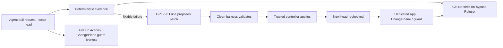

# ChangePlane

> **Keep GitHub. Let agents ship.**

The independent assurance plane for code written and repaired by AI agents.

Deployed technical baseline: **1.0.0** · managed repository payload: **v15**, under controlled engineering qualification. The [current release observation](docs/current-release.md) records protected deployment, organization-owned Verify onboarding, strict publisher binding and a successful same-SHA rerun. It also preserves the failed canaries that led to the fix and the measured limits of recovery. Customer onboarding remains closed: `guardPublicationSerialized` stays false pending provider durability and recovery evidence, followed by exact-release legal approval and an explicit alpha repository allowlist. See [automated SDLC architecture and release blockers](docs/automated-sdlc-architecture.md).

Every hosted Guard write, including owner canaries, requires the [authority journal](docs/guard-publication-journal.md). The separate Guard App and approved isolated Free journal have published real synthetic checks from protected Production. Missing, invalid, unavailable or unenrolled authority stops publication; disabling the journal never restores an unjournaled path. Configuration readiness alone proves no database health or zero-loss recovery. Occupied incident authority is retained, and legal documents remain drafts.

For finite, operator-enrolled Verify Lite pilots, the candidate also [records accepted evaluations atomically](database/README.md#commercial-plane) before the verification workload. Retry and telemetry retention cannot charge another quota unit for the same authenticated attempt. A denied or unavailable allowance closes the Guard as `action_required`; admitted work can still complete or recover. This is a quota boundary, not automated invoicing, complete commercial telemetry, or activation of the public pricing plans.

The managed release places publisher-bound assurance between an agent-authored pull request and GitHub policy. The GitHub-owned Actions job reports operational liveness as `ChangePlane guard`; it is not merge authority. A separately credentialed GitHub App owns the assurance result `ChangePlane / guard`. A model may propose a bounded patch, the deterministic harness decides, and the controller applies only an accepted patch. Only the same authenticated workflow run and attempt may complete the App-owned guard from the latest workflow-bound evidence on the exact head.

[Request Design Partner Alpha access](docs/design-partner-order-form.md) or [open the RouteThai example](https://changeplane.vercel.app/) without signing in. The hosted installer becomes available only to pre-approved repositories after the protected release gate.

## What ChangePlane does

The bounded autonomous repair path is implemented to run without a per-pull-request dashboard or manual handoff:

1. Start the GitHub-owned `ChangePlane guard` job and ask the dedicated App to block the stable exact-head `ChangePlane / guard` (`in_progress` initially, `action_required` during a completed Check's rerun), superseding any prior App result for that revision before mutable inputs are read.
2. Bind the pull request's exact head, base, refs, changed paths, title, and one meaningful behavioral Check.
3. Evaluate deterministic evidence from the trusted repository configuration.
4. Return a fixable failure to GPT-5.6 Luna for a bounded patch proposal.
5. Reject malformed, stale, protected, expanded, or exhausted work in a clean validation job.
6. Let a trusted controller apply an accepted patch with one short-lived, exact-repository credential.
7. Re-run evidence on the new head. The dedicated App completes `ChangePlane / guard` only for the same OIDC-authenticated run and attempt, after re-fetching the latest eligible exact-head evidence and current GitHub target.

Protected, ambiguous, stale, provider-failed, or exhausted work stops for a human. GitHub remains the forge, branch-policy surface, and merge authority.

ChangePlane exposes three deliberately different authority profiles. Hosted onboarding starts with the smallest useful authority and expands only through another reviewed pull request:

- **Verify Lite · default setup.** Cursor, Codex, Claude Code, or another customer-selected agent owns the fix. The nine-file managed profile runs deterministic exact-head assurance without a provider key, model-backed review job, repair workflow, repair webhook, controller HMAC, or controller installation credential.
- **Autonomous · controlled beta.** A bounded proposal model may suggest a repair and a separately credentialed controller may apply it before fresh exact-head evidence is evaluated. This uses the 21-file Full profile. Moving from Verify Lite to Autonomous creates a separate protected expansion pull request; it does not silently widen the installed authority.
- **Observe.** ChangePlane records the exact revision and scope without claiming behavioral proof or blocking merge.

The manifest is not authority by itself. Runtime and BYOK operations proceed only when its declared profile matches every managed blob and reserved path on the exact default-branch Git tree; an injected repair workflow, forged profile, missing file, or modified byte fails closed.

“Blocking-capable” is not the same as active merge enforcement. ChangePlane exposes two evidence-backed assurance levels. **Strict Head** requires one independently complete active repository or inherited-organization Ruleset targeting the default branch, with no bypass actors, strict up-to-date status checks, and the dedicated-App `ChangePlane / guard` plus every configured behavioral evidence Check bound to its expected integration ID. **Queue Certified** adds a Merge Queue rule and evaluates each `merge_group` as a fresh exact revision. Classic branch protection, unknown targeting, wildcard ambiguity, bypasses, controls split across Rulesets, missing or misbound Checks, and malformed Rulesets data fail closed. The installer may create only the exact no-bypass Ruleset plan shown to a repository administrator after digest-bound approval; it never merges code or weakens an existing rule. `ChangePlane guard` remains operational workflow liveness only.


```mermaid
flowchart LR
    A["Agent pull request · exact head"] --> B["Deterministic evidence"]
    A --> H["GitHub Actions · ChangePlane guard liveness"]
    B -->|"fixable failure"| C["GPT-5.6 Luna proposes patch"]
    C --> D["Clean harness validates"]
    D --> E["Trusted controller applies"]
    E --> F["New head rechecked"]
    F --> G["Dedicated App · ChangePlane / guard"]
    B --> I["GitHub strict no-bypass Ruleset"]
    G --> I
```

The proposal job receives no GitHub token, App private key, controller secret, push credential, approval authority, merge permission, or Check authority. A model cannot return `PASS`.

## Agentic SDLC assurance

The immediate commercial outcome is founder-led Verify Lite plus Strict Head, measured with the [30-day launch scorecard](docs/launch-measurement.md). Run `npm run report:launch` for the empty evidence baseline; it reports `not_started` rather than inferring customer traction from engineering tests.

ChangePlane now projects its existing exact-revision controls across the software-delivery lifecycle without becoming another planning board, IDE, CI service, deployment platform, or operations console. The repository runtime-readiness response describes which lifecycle checkpoints are controlled, supported, external, or still need setup. The signed-out RouteThai workspace teaches the same boundary through an interactive seven-step synthetic spine: **Intent → Change → Review → Verify → Delivery → Merge → Operate**. A live per-pull-request SDLC API or managed receipt field is not part of this candidate.

The projection is deliberately read-only. It does not create a second evaluator, aggregate trust across commits, or contribute another signal to `PASS`. Intent is declared repository context; agent identity and model review are advisory; the deterministic harness alone evaluates behavioral evidence; exact-SHA deployment metadata is informational; GitHub owns merge; and production operation remains in the customer's existing systems. Every new commit restarts the revision-level assurance spine.

This gives Codex, Cursor, Claude Code, Copilot, Trae, OpenSWE, and other coding agents a shared GitHub-native handoff contract without requiring them to join a proprietary agent runtime. See [Agentic SDLC assurance](docs/agentic-sdlc.md) for the stage model, authority matrix, API projection, and explicit non-goals.

## Install on GitHub

ChangePlane supports individual developers with personal accounts and businesses with GitHub organizations, including Enterprise Cloud organizations. Neither group needs to create a different account type to use ChangePlane. Repository protection still depends on the customer's GitHub plan and verified Rulesets; see the [support matrix](docs/operating-budget.md#individual-and-business-support). Release-owner organization canaries are internal verification, not an organization-only customer restriction.

For an accepted Design Partner Alpha repository, hosted onboarding needs no CLI, ChangePlane account provisioning, or customer Vercel configuration:

1. Select **Install ChangePlane on GitHub**.
2. On GitHub, choose a personal account or organization and grant the repository-scoped App access only to the intended repositories.
3. Return to ChangePlane and choose one writable repository from an installation visible to the signed-in user. Repository-admin access is required before ChangePlane may inspect or change Actions Secrets.
4. Complete the read-only safety preflight.
5. Bind one existing behavioral Check and its publisher, then install the nine-file Verify Lite profile. Deliberately choose scope-only Observe when behavioral proof is unavailable. A fresh repository cannot opt directly into Autonomous.
6. Review and merge the protected Verify Lite setup pull request. Automation remains inert until GitHub reports that pull request merged.
7. After one normal pull request records the live publishers, review Deliberate Approval 3 of 3. ChangePlane binds the repository ID, exact default-branch SHA, current Ruleset inventory, Guard publisher, evidence publishers, zero bypasses, and requested assurance level into one digest. A repository administrator may apply that exact plan once; drift forces a fresh review. Strict Head is the default. Queue Certified is an explicit upgrade.
8. Only after Queue Certified is active may an approved controlled-beta owner request the 21-file Full expansion through another protected pull request and complete the repository BYOK flow. ChangePlane verifies the selected allowlisted model, encrypts the key with GitHub's repository public key, stores only `OPENAI_API_KEY` as an Actions Secret, and clears the browser field after every attempt.

Autonomous mode requires the repository-scoped Installer App, a repository admin, Queue Certified assurance, an exact behavioral Check and expected publisher, verified repository BYOK, and the reviewed Full-profile setup. GitHub Actions evidence in Verify or Autonomous must also declare its exact trusted `.github/workflows/*.yml` or `.yaml` path. Verify Lite receives no OpenAI key or repair credential. Merge Queue execution does not replace these activation prerequisites. Verify onboarding requires Administration read; Administration write is optional and checked live only when an administrator applies an approved Ruleset plan. Without it, the reviewed policy can be configured in GitHub and rechecked here. Every missing gate fails closed. Scope-only Observe never dispatches repair and does not block merge or deploy.

### Recovering a v11 or v12 enforce policy

An otherwise pristine v11/v12 installation may have a `github-actions` behavioral Check without the exact workflow path now required by v13. Preflight identifies that shape instead of carrying an unusable policy forward. A repository administrator must select one exact Check, publisher, and `.github/workflows/*.yml` or `.yaml` path; ChangePlane then includes the minimal `.changeplane.json` repair in the same human-reviewed upgrade pull request. The recovered mode defaults to Verify. Scope-only Observe is available only when selected explicitly, and Autonomous is never retained or provisioned by this migration.

After merge, the owner must replace any legacy branch-policy binding that treated the `github-actions` publisher of `ChangePlane / guard` as authoritative. V13 authority belongs to the dedicated ChangePlane App in the qualifying Ruleset; `ChangePlane guard` remains operational liveness. The migration never writes the default branch or changes a Ruleset.

### Supported platforms

- GitHub.com personal accounts and organizations, including Enterprise Cloud organizations.
- Same-repository pull requests.
- GitHub Merge Queue for exact-revision guard evaluation only.
- Read-only readiness for the deliberately narrow, fail-closed GitHub Rulesets shape described above.
- Current desktop and mobile browsers for onboarding and the public example.
- Node.js `>=22.18 <23` for local verification.

GitHub Enterprise Server, GitLab, Bitbucket, fork pull requests, cross-repository repair, ambiguous or bypass-bearing Rulesets topologies, managed model billing, and automatic merge are not supported in this candidate.

## Hosted service and Vercel

Customers use the hosted product at [changeplane.vercel.app](https://changeplane.vercel.app/). They do not deploy this repository to Vercel, connect a Vercel account to ChangePlane, or share Vercel credentials.

If a connected repository already publishes previews through Vercel's GitHub integration, ChangePlane may include the existing preview in its receipt only when the corresponding GitHub Deployment SHA exactly matches the evaluated pull-request head. ChangePlane does not host the preview and does not require access to the customer's Vercel account.

Every hosted API route that can reach GitHub or OpenAI requires an attributed Vercel Production deployment from this repository's protected `main` branch. Fork deployments, CLI uploads, previews, and deployments without verified Git provenance fail closed before external access. Self-hosting and commercial operation of this source are not licensed or supported.

See [Hosted service boundary](docs/hosted-service.md) for the operator and customer trust model.

## Product controls

- **Exact-revision guard.** Every contract, receipt, grant, review, preview, and decision is bound to one commit SHA. A new commit invalidates the prior assurance.
- **Ruleset-bound assurance.** Strict Head requires one strict, no-bypass default-branch Ruleset with the dedicated-App `ChangePlane / guard` and every behavioral evidence Check bound to its expected integration. Queue Certified additionally requires Merge Queue. The GitHub-owned `ChangePlane guard` job remains operational liveness and carries no merge authority.
- **Ordered guard lifecycle.** Before mutable pull-request or evidence inputs are evaluated, the dedicated App creates or updates one stable exact-head Check to `in_progress` and supersedes older App successes. The GitHub run ID and attempt form a monotonic Evaluation Generation: a newer generation may re-evaluate the same SHA, while completion is accepted only from the latest authenticated generation. Older or duplicate completions, changed targets, and newer eligible evidence fail closed.
- **Independent review.** `ChangePlane / review` may publish up to five validated findings on changed lines. It is advisory and cannot approve, repair, certify, or contribute to PASS.
- **Repository assurance memory.** `.changeplane/assurance.md` stores reviewed invariants beside the code. It guides review but is never behavioral evidence.
- **Bounded autonomous repair.** A campaign allows at most two attempts within one immutable 15-minute budget. Tests, evidence configuration, dependency manifests, managed files, and repository-protected paths require human review.
- **Agent handback.** GitHub-native receipts can return bounded findings to Codex, Cursor, Claude Code, Trae, Copilot, OpenSWE, or another coding agent without granting it controller authority.
- **Verify-only gate.** Customer-selected agents own repair while ChangePlane independently evaluates the current exact commit and any newer Evaluation Generation. The guard is blocking-capable only through the qualifying GitHub Ruleset; GitHub remains the only merge-enforcement authority.
- **Verify Lite payload.** The default protected setup pull request contains nine files. It omits the standalone provider, review, proposal, ledger, controller, and repair-workflow files that are unnecessary for independent verification; deterministic remediation findings remain available for agent handback.
- **Explicit authority expansion.** Enabling Autonomous from Verify Lite proposes the 21-file Full profile through a separate protected pull request and keeps repair inactive until the reviewed payload is present.
- **Assurance Passport.** Every pull-request and Merge Queue receipt carries a vendor-neutral, machine-readable exact-head envelope for the policy, evaluator, evidence, decision, and separation of authority. Its domain-separated SHA-256 detects tampering; live correspondence still requires the matching `ChangePlane / guard` Check on GitHub. In the v13 lifecycle, a successfully completed App guard emits a redacted `proof_locator` so an authenticated verifier can re-fetch the guard, every evidence Check, the trusted-base policy, and the current pull-request revision. It is evidence, never a credential or authorization token.
- **Cursor Origin boundary proof.** The signed-out product and `npm run prove:origin-boundary` execute twelve deterministic contract scenarios, including three GitHub-mirrored Origin fixtures, and evaluate six product assertions. The proof shows that the authoring surface does not change the deterministic decision, a stale mirror view cannot inherit assurance, and a protected test change cannot self-certify. A passing fixture is only `guardEligible`; the proof publishes no Check, writes no repository, makes no GitHub or Origin API request, and is not an external benchmark.
- **Preview binding.** Existing GitHub Deployment and Vercel preview URLs are shown only when their deployment SHA matches the evaluated head.
- **Merge Queue guard.** A `merge_group` is evaluated as its own revision. Queue runs never dispatch review, proposal, repair, apply, or handback work.
- **Trusted-base execution.** Pull-request workflows always execute the managed controller from the live default-branch revision. A retargeted pull request, changed default-branch SHA, stale event base, or mismatched controller SHA publishes no successful assurance.
- **SDLC assurance spine.** Repository runtime readiness exposes a derived lifecycle posture; the signed-out RouteThai synthetic contract reconstruction provides the exact-revision explainer from intent through operation. Neither contributes to PASS: a new commit invalidates the reconstructed view, delivery stays informational, GitHub owns merge, and operation stays external.

### Agent and forge compatibility

ChangePlane deliberately stays downstream of the coding agent. Codex, Cursor, Claude Code, or another tool may author and repair the pull request; none of those identities is trusted as a PASS input.

Cursor Origin is a Git forge, not merely an editor feature. Cursor documents repositories, pull requests, Checks, rulesets, APIs, and GitHub mirroring; its own API already supports full-SHA Checks, publisher-bound required Checks, stale-update ordering, rulesets, and expected-head merge. ChangePlane therefore does not claim that Origin lacks exact-head controls.

The defensible product boundary is different: a team can keep GitHub as its independently observable source of truth, branch-policy surface, and merge authority while Cursor Origin is an optional authoring and mirror surface. For a repository [mirrored from GitHub into Origin](https://cursor.com/docs/origin/mirror-github), ChangePlane evaluates the GitHub revision and publishes evidence back to GitHub. It does not require a second forge or trust a Cursor, Codex, Claude Code, or other agent identity as a PASS input. Standalone Origin repositories remain unsupported and untested.

There are two proof tiers:

1. `npm run prove:origin-boundary` and `GET /api/github?action=origin-proof` run the public deterministic contract with zero external requests.
2. After a real guard run, `GET /api/github?action=proof&repository=OWNER/REPO&checkRunId=ID&passportDigest=SHA256` re-fetches the live guard, trusted policy, every evidence Check, and current pull-request head from GitHub and returns `VERIFIED_CURRENT`, `VERIFIED_HISTORICAL`, `INVALID`, or `INDETERMINATE`.

The v13 release routes guard publication through a dedicated Guard App. The managed workflow has read-only Actions and Checks access plus GitHub OIDC; it cannot publish `ChangePlane / guard` with `GITHUB_TOKEN`. At begin, the publisher verifies the exact repository, trusted workflow revision, event, ref, run ID and attempt, then opens the stable App-owned Check as `in_progress`. The run ID and attempt form a monotonic Evaluation Generation: a newer generation may freshly re-evaluate the same SHA, but an older or duplicate completion cannot overwrite it or inherit PASS. At completion, the publisher re-fetches trusted policy, current target, and latest workflow-bound exact-head evidence. Read and `checks:write` credentials are minted separately for one repository. Operational readiness remains available during a legacy shared-App migration, while `commercialReady` additionally requires distinct Installer and Guard Apps plus database verification and legal approval bound to the exact protected deployment SHA. The public v13 canary proves the dedicated-App lifecycle on exact GitHub revisions, including stale-head re-evaluation and protected-test refusal. The available personal-account repository cannot supply live Queue Certified evidence, and the real Cursor Origin mirror canary is blocked without a paid subscription; no production superiority claim is made. See [the v13 release evidence](evidence/changeplane-v13-production-release.json) and [Cursor Origin boundary and proof](docs/cursor-origin-boundary.md).

## Runtime contract

The server, UI, workflow, and tests share one model policy from [`src/lib/runtime.js`](src/lib/runtime.js):

```js
DEFAULT_PROPOSAL_MODEL = "gpt-5.6-luna"

SUPPORTED_PROPOSAL_MODELS = [
  "gpt-5.6-luna",
  "gpt-5.6-terra",
  "gpt-5.6-sol",
]
```

The trusted repository policy keeps model selection and repair limits auditable:

```json
{
  "harness": {
    "mode": "autonomous",
    "maxAttempts": 2,
    "budgetMinutes": 15
  },
  "runtime": {
    "funding": "byok",
    "provider": "openai",
    "secretName": "OPENAI_API_KEY",
    "model": "gpt-5.6-luna",
    "reasoningEffort": "high",
    "managedSubscription": "reserved"
  }
}
```

Policy is read only from the trusted default branch. Pull-request code cannot select the model, increase the attempt budget, or expand authority for its own run. Model changes create a protected configuration pull request limited to `.changeplane.json`.

The OpenAI adapter uses native `fetch` with the Responses API, `reasoning.effort: "high"`, `store: false`, exact failure evidence, allowed-path source context only, and a strict structured patch field. Unsupported models, refusal, timeout, oversized or malformed output, non-patch output, protected paths, and clean-validation failures are rejected before repository mutation. Compatibility adapters remain outside the supported product UI.

## RouteThai production use

ChangePlane is used with RouteThai in production. That private use informs product constraints while keeping the repository, routing data, customer context, and operating details private; it is not public evidence for the current v13 dedicated publisher.

The signed-out RouteThai workspace is a synthetic contract reconstruction of the same assurance pattern, not a replay of a stored production run. Every public stop ID, service window, repository name, source file, timestamp, and evidence value is synthetic. It makes no request to RouteThai production systems and contains no customer name, coordinate, map URL, production workbook, private-repository screenshot, or operating data.

The reusable fixture is under [`examples/routethai-synthetic`](examples/routethai-synthetic). Historical, release-scoped redacted evidence is under [`evidence`](evidence). The managed-v13 baseline dedicated-App/OIDC lifecycle is deployed and protected-canary proven only for the exact revisions recorded in [`evidence/changeplane-v13-production-release.json`](evidence/changeplane-v13-production-release.json); that record must not be reused as proof of later source changes, Queue Certified, distinct Installer/Guard principals, or customer rollout.

## Local verification

Requirements: Node.js `>=22.18 <23`.

```sh
npm ci --cache .npm-cache
npm run verify
npm run test:e2e
npm run audit:prod
```

Run the signed-out product surface locally:

```sh
npm run dev
```

The RouteThai fixture intentionally begins in a failing state:

```sh
node --test examples/routethai-synthetic/service-window.test.js
```

For the fastest evaluation path, use [EVALUATION.md](EVALUATION.md). A live adapter canary is optional and requires an operator-owned `OPENAI_API_KEY` with access to `gpt-5.6-luna`; never paste a provider key into chat, an issue, a log, a screenshot, or source control.

## Built with Codex and GPT-5.6

Codex was the implementation and verification partner across the OpenAI adapter, GitHub App and BYOK onboarding, autonomous controller boundary, fail-closed tests, browser journeys, historical production canary, and release evidence. The product owner retained the authority model, product scope, production-data boundary, and release decisions.

GPT-5.6 Luna is the real default for bounded patch proposals and advisory review, not a display-only selection. Terra and Sol use the same allowlisted contract. The model proposes from bounded evidence; it never validates its own patch, writes to GitHub, publishes a required Check, or decides PASS.

## Trust and operations

- [Security policy](SECURITY.md)
- [Data handling](docs/data-handling.md)
- [Production runbook](docs/production-runbook.md)
- [Release checklist](docs/release-checklist.md)
- [Release history](CHANGELOG.md)
- [Support](SUPPORT.md)
- [Third-party notices](THIRD_PARTY_NOTICES.md)

ChangePlane does not claim autonomous merge, managed model execution, zero data retention, SOC 2, GDPR compliance, 24/7 support, or unmeasured enterprise scale.

## License

Copyright © 2026 ChangePlane. All rights reserved.

The source is publicly visible but proprietary and `UNLICENSED`. Public visibility does not grant permission to copy, deploy, modify, redistribute, or operate it. Third-party dependencies retain their own licenses.
