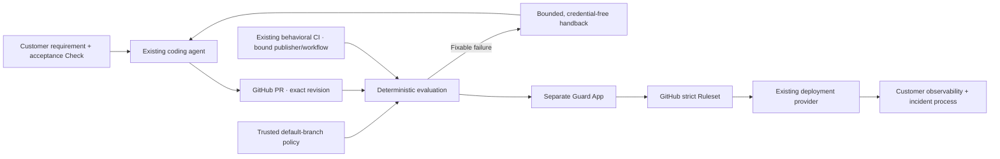

# ChangePlane in automated software delivery

ChangePlane's first sellable outcome is **a customer can let its coding agents produce more pull requests while GitHub consistently withholds merge on missing, stale, or failed behavioral evidence**. Start with founder-led Verify Lite and Strict Head. Repair, managed billing, a fleet interface, and production operations are separate expansions with their own evidence gates.

The protected production baseline is `ddccd7ab7721c28542a0e4a36956cbc307832672`. This document describes a later managed-v14 candidate and its remaining blockers. Neither local tests nor a reviewed source change establish customer readiness.

## One delivery loop, distinct owners

Every new commit starts fresh assurance. A new Evaluation Generation on the same commit also revokes earlier completion authority. Customer acceptance remains in repository-owned behavioral Checks; model review remains advisory. Existing deployment metadata may accompany a matching full SHA but cannot establish PASS or production health.

The architecture keeps four useful modules with small interfaces:

| Module | Interface and responsibility | Evidence it cannot manufacture |
| --- | --- | --- |
| Repository activation | Bind installation, repository, trusted policy, managed bytes, and an explicitly approved Ruleset plan | Customer demand, legal approval, or live canary results |
| Revision assurance | Evaluate one revision and generation from trusted policy and publisher/workflow-bound evidence; return findings | Model-originated PASS or cross-revision assurance |
| Guard publication | Authenticate the workflow, generation, revision and latest evidence before changing the App Check | Merge authority; currently lacks atomic generation fencing |
| Launch measurement | Summarize operator-attested pilot evidence without source or credentials | Guard decisions, payment authorization, production monitoring or independent audit |

These are responsibility seams, not new network services. The current hosted adapter still contains substantial GitHub orchestration in `api/github.js`. Extracting it wholesale would obscure the high-priority authority fixes. Keep policy logic deterministic and tested through its interface; move a cluster only when its callers share an invariant worth centralizing. The launch access gate now has one decision path used by readiness, session and every externally accessing route.

## Changes prepared in this candidate

1. **Customer access cannot be inferred from an allowlist.** Exact-release legal approval, a distinct Guard principal and implemented publication serialization are required. Declared alpha or self-service mode remains visible with a specific reason and one next action when access is paused. The owner canary remains available. Commercial readiness additionally requires implemented ingestion and entitlement enforcement; environment flags alone cannot establish it.
2. **Installed recovery now exists.** Both managed-v14 profiles include the scheduled OIDC sweep already supported by the controller. It only closes an expired Guard as `action_required`, never PASS. A recovery makes the workflow fail so GitHub's opted-in failed-workflow notification can surface the incident. Scheduling is best effort; its five-minute expression does not prove the ten-minute service target. The current expiry is 25 minutes (campaign plus reconciliation window), so Verify-pilot recovery still needs a shorter, independently validated liveness policy before that target can be met.
3. **Upgrades preserve authority.** Immutable v13 manifests are recognized independently for Full and Verify Lite. A normal Lite upgrade retains Lite rather than silently installing review/repair authority.
4. **Same-SHA contracts survive re-evaluation.** The App-owned authenticated contract digest is preserved through a new begin and timeout reconciliation. A changed contract is rejected at completion. Fresh target/generation checks occur after evidence lookup and token creation.
5. **Strict Head is represented correctly.** A complete strict, no-bypass, publisher-bound Ruleset activates the derived merge-gate view without Merge Queue. Autonomous Repair still requires queue coverage and all existing activation gates.
6. **Pilot outcomes can be measured.** The offline scorecard distinguishes absent evidence from zero incidents, includes pending Guards, rejects duplicate records, and requires a complete 30-day coverage attestation. Candidate monthly usage counts a generation in its earliest recorded UTC month, avoiding a double count when begin and completion span months. This candidate store is still unsuitable as an enforced billing ledger.

## Release blocker: publication must have one writer

The current publisher changes a shared GitHub Check using a separate read and write. The following interleaving remains possible even with a last-moment revalidation:

1. Completion A reads generation A from the Check.
2. Begin B replaces that Check with generation B and `in_progress`.
3. Completion A's already authorized request writes `success` to the same Check.

The final GitHub Checks PATCH is not protected by a demonstrated compare-and-swap primitive. A generation marker detects stale state when read; it does not atomically fence a later write. GitHub Actions cancellation also cannot retract a hosted request already in flight. Reconciliation and deployment-triggered runs add additional writers.

Consequently the candidate's `guardPublicationSerialized` capability is false and external alpha remains paused. No environment variable can turn missing serialization into proof. Late revalidation is a mitigation for detectable intervening changes, not closure of this race. The owner canary is a controlled experiment and must not be used to claim customer-safe publication.

The preferred next implementation to validate is a **trusted GitHub Actions publication lane** covering begin, completion and reconciliation, with all App Check mutations executed synchronously inside one non-cancelling writer. It uses the existing operational substrate instead of introducing a ChangePlane database or queue. Any design must prove that the lane spans the full external write lifetime and that rejected/cancelled pending work becomes a safe, recoverable block. A distributed ref lease without write fencing, another preflight GET, or a process-local mutex on Vercel is insufficient. Immutable per-generation Checks are an alternative only after GitHub's exact required-check selection semantics are proven; do not assume newest-looking metadata is merge authority.

Before removing the capability gate, adversarial integration and protected organization-owned canaries must interleave begin/complete/reconcile, same-SHA reruns, new commits, provider delays, cancellation and worker interruption. Prove that an older generation cannot leave a usable success after a newer generation starts. Include notification delivery, scheduler delays and restoration of a stalled Guard in the release evidence.

## Path to a paid pilot

| Gate | Completion evidence | Owner |
| --- | --- | --- |
| Publication serialization | Interleaving tests plus a protected live canary on the exact candidate | Engineering |
| Separate principals | Distinct Installer/Guard Apps, exact repository installation binding, allowed permissions | Release owner |
| Customer enforcement | Organization-owned Strict Head same-SHA canary, failed evidence, supersession and timeout recovery | Engineering + customer administrator |
| Legal and support | Reviewed entity/jurisdiction/contact/payment terms, exact-release legal pack and signed order form | Founder + qualified legal reviewer |
| Design partners | Three to five approved customer organizations, named support owners and narrow repository allowlist | Founder |
| Willingness to pay | Reviewed manual invoice or payment link, actual net revenue and variable costs | Founder |
| Thirty-day outcomes | Private ledger, coverage references and reproducible scorecard | Founder + release owner |

A database is not necessary to learn whether a manually invoiced pilot is valuable. Automated plans, usage restrictions, Fleet history and commercial readiness do require the existing candidate store to be connected to authenticated event ingestion, tenancy, entitlements, retention/deletion and tested recovery. Do not sell those capabilities until their live evidence exists. No external customer, payment, legal review, database drill or Origin subscription result has been created by this implementation work.

## Why this improves automated SDLC

The design focuses on shorter, trustworthy feedback loops and measurable outcomes. DORA describes AI as amplifying existing delivery strengths and weaknesses and identifies small batches as an enabling capability; that supports investing in the surrounding delivery system and customer value rather than adding another authoring tool. See the [2025 DORA report](https://dora.dev/research/2025/dora-report/) and [small-batch capability](https://dora.dev/capabilities/working-in-small-batches/).

GitHub requires fresh CI participation for merge groups, which supports treating queue revisions separately. See [managing a merge queue](https://docs.github.com/en/repositories/configuring-branches-and-merges-in-your-repository/configuring-pull-request-merges/managing-a-merge-queue). SLSA's provenance model separates an artifact's source/build identity from its functionality; similarly, ChangePlane keeps provenance, behavioral evidence and advisory review distinct. This is an architectural comparison, not a claim of SLSA certification. See [SLSA build track](https://slsa.dev/spec/v1.2/build-track-basics).
