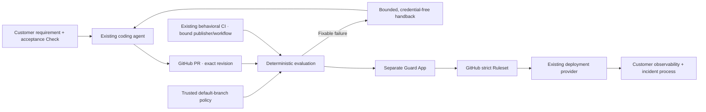

# ChangePlane in automated software delivery

ChangePlane's first sellable outcome is **a customer can let its coding agents produce more pull requests while GitHub consistently withholds merge on missing, stale, or failed behavioral evidence**. Start with founder-led Verify Lite and Strict Head. Repair, managed billing, a fleet interface, and production operations are separate expansions with their own evidence gates.

The protected production baseline is `ddccd7ab7721c28542a0e4a36956cbc307832672`. This document describes a later managed-v14 candidate and its remaining blockers. Neither local tests nor a reviewed source change establish customer readiness.

## One delivery loop, distinct owners

Every new commit starts fresh assurance. A new Evaluation Generation on the same commit also revokes earlier completion authority. Customer acceptance remains in repository-owned behavioral Checks; model review remains advisory. Existing deployment metadata may accompany a matching full SHA but cannot establish PASS or production health.

The architecture keeps four useful modules with small interfaces:

| Module | Interface and responsibility | Evidence it cannot manufacture |
| --- | --- | --- |
| Repository activation | Bind installation, repository, trusted policy, managed bytes, and an explicitly approved Ruleset plan | Customer demand, legal approval, or live canary results |
| Revision assurance | Evaluate one revision and generation from trusted policy and publisher/workflow-bound evidence; return findings | Model-originated PASS or cross-revision assurance |
| Guard publication | Authenticate the workflow, generation, revision and latest evidence; hold the candidate journal lane across App Check mutations | Merge authority; live journal topology and durability remain unproven |
| Launch measurement | Summarize operator-attested pilot evidence without source or credentials | Guard decisions, payment authorization, production monitoring or independent audit |

These are responsibility seams, not new network services. The current hosted adapter still contains substantial GitHub orchestration in `api/github.js`. Extracting it wholesale would obscure the high-priority authority fixes. Keep policy logic deterministic and tested through its interface; move a cluster only when its callers share an invariant worth centralizing. The launch access gate now has one decision path used by readiness, session and every externally accessing route.

## Changes prepared in this candidate

1. **Customer access cannot be inferred from an allowlist.** Exact-release legal approval, a distinct Guard principal and live-verified journal publication are required. Declared alpha or self-service mode remains visible with a specific reason and one next action when access is paused. Hosted owner-canary publication also requires the journal and has no unjournaled fallback. Commercial readiness additionally requires implemented ingestion and entitlement enforcement; environment flags alone cannot establish it.
2. **Recovery follows the trusted mode.** Both managed-v14 profiles include the scheduled OIDC sweep. Scheduled and administrator recovery derive the mode from validated managed policy on the current exact default-branch revision; request payloads cannot shorten the budget. Verify and Observe become eligible for safe recovery at five minutes only after GitHub confirms that the exact owning workflow run attempt is terminal. A live or unverifiable owner, Autonomous mode, and a helper call without trusted mode context retain the conservative 25-minute fallback. Omitted policy harness settings follow the existing Observe default; they do not establish owning-run completion. Recovery closes a Guard only as `action_required`, never PASS, and fails the workflow so GitHub's opted-in failed-workflow notification can surface the incident. The five-minute schedule is best effort; actual recovery latency and notification delivery still require a live canary before claiming the ten-minute service target.
3. **Upgrades preserve authority.** Immutable v13 manifests are recognized independently for Full and Verify Lite. A normal Lite upgrade retains Lite rather than silently installing review/repair authority.
4. **Same-SHA contracts survive re-evaluation.** The App-owned authenticated contract digest is preserved through a new begin and timeout reconciliation. A changed contract is rejected at completion. Fresh target/generation checks occur after evidence lookup and token creation.
5. **Strict Head is represented correctly.** A complete strict, no-bypass, publisher-bound Ruleset activates the derived merge-gate view without Merge Queue. Autonomous Repair still requires queue coverage and all existing activation gates.
6. **Pilot outcomes can be measured.** The offline scorecard distinguishes absent evidence from zero incidents, includes pending Guards, rejects duplicate records, and requires a complete 30-day coverage attestation. The legacy telemetry projection counts a generation in its earliest retained UTC month; it remains unsuitable for billing.
7. **Finite pilot allowances have an admission boundary.** Authenticated Verify Lite pull requests can consume one immutable quota unit under an operator-enrolled contract lasting at most 30 days. The database serializes admission across the tenant, assigns the UTC period, and deduplicates the exact workflow attempt. Retained telemetry cannot move this counter. A denial or unavailable store invalidates prior usable success and closes the Guard as `action_required` before the API returns an error, while admitted work can complete or recover without another charge. The verified workflow start must lie inside the active contract window, preventing an old generation from becoming a new admission after 90-day receipt pruning. Public plans, outcome ingestion, invoicing and live operating controls remain separate work; this does not enable commercial readiness.

A human-reviewed downgrade from Autonomous to Verify or Observe may revoke an in-flight repair's old authority. The repair controller checks the live policy digest against signed authority before mutation, while recovery uses the new trusted mode and independently checks the owning run before shortening its window. The immutable 15-minute campaign and 25-minute fallback are upper limits; they do not guarantee continued processing after authority changes. This mode transition does not establish the journal's operating guarantees below.

## Candidate journal and remaining release proof

The earlier unjournaled publisher changed a shared GitHub Check using a separate read and write. Last-moment revalidation alone allowed this interleaving:

1. Completion A reads generation A from the Check.
2. Begin B replaces that Check with generation B and `in_progress`.
3. Completion A's already authorized request writes `success` to the same Check.

The final GitHub Checks PATCH is not protected by a demonstrated compare-and-swap primitive. A generation marker detects stale state when read; it does not atomically fence a later write. GitHub Actions cancellation also cannot retract a hosted request already in flight. Reconciliation and deployment-triggered runs add additional writers.

The source now contains a **PostgreSQL publication journal candidate** around begin, completion, and reconciliation. The trusted server authenticates tenant/repository/installation/App identity and claims a durable lane for the repository and exact revision fingerprint before mutable Guard reads. The callback holds ownership across awaited Check writes and response validation. Concurrent duplicates cannot enter the occupied lane. Missing acknowledgement, failed validation after a write starts, detached writes, or process loss leave ownership held or poisoned; no timer, expiry, or automatic retry transfers authority. Credentials stay server-side, and this design adds no writer workflow or runner credential exchange. See the [journal operating design](guard-publication-journal.md), [migration](../database/002_guard_publication_journal.sql), and [adapter](../server/guard-publication-journal.js).

Every `VERCEL=1` Guard mutation requires the journal, including owner-canary writes. Configuration requires a distinct Guard App, enabled `true`, a PostgreSQL URL with `sslmode=verify-full`, an epoch UUID, and a verified 40-character source release matching enrollment. Missing, disabled, invalid, unenrolled, or unavailable authority stops publication; disabling the journal does not restore the earlier publisher. Do not promote the candidate before the dedicated database and a separate new Guard App are enrolled.

The `guardJournalConfiguration` and `guardJournalConfigured` readiness fields describe configuration only; no health, enrollment, replication, or restore probe is implied. The candidate's `guardPublicationSerialized` capability remains false and external alpha remains paused. An environment attestation cannot establish the missing live topology and durability evidence. Database rollback or failover must lose no acknowledged exclusion decision while an old writer can still affect GitHub. If that cannot be proven, halt and move to a new Guard principal with freshly approved publisher-bound Rulesets; deleting a lane or changing an epoch cannot fence an in-flight request.

Before removing the capability gate, adversarial integration and protected organization-owned canaries must interleave begin/complete/reconcile, same-SHA reruns, new commits, provider delays, cancellation and worker interruption. Prove that an older generation cannot leave a usable success after a newer generation starts, and that uncertain writes survive process loss, capacity limits, and the selected restore/failover topology without takeover. Include role/tenant isolation, credential rotation, journal-aware rollback, notification delivery, scheduler delays and restoration of a stalled Guard in the release evidence. Local protocol tests do not establish these live operating guarantees.

## Current milestone: free engineering preparation

The founder requires **USD 0 now** and reserves **USD 100 per month for scale**. Use the existing source/hosting setup and disposable synthetic qualification resources; do not purchase or provision a persistent database as part of this phase. Verify Lite needs no model key, and billing automation is deferred. Personal and organization GitHub support remain product requirements; GitHub plan eligibility still determines whether a repository can enforce Strict Head. See the [phase budget and hosting eligibility](operating-budget.md).

Qualify runtime authentication, TLS, authority isolation and failure behavior without publishing a live Guard or enrolling a customer. Delete temporary resources after recording bounded evidence. Free engineering completion does not imply commercial hosting eligibility, durable production authority, organization enforcement, effective legal terms or customer outcomes. Preserve the capability gates until their own evidence exists.

## Later path to a paid pilot

| Gate | Completion evidence | Owner |
| --- | --- | --- |
| Publication serialization | Journal integration, zero-loss authority/fenced recovery, and a protected live canary on the exact deployment and epoch | Engineering |
| Separate principals | Distinct Installer/Guard Apps, exact repository installation binding, allowed permissions | Release owner |
| Customer enforcement | Organization-owned Strict Head same-SHA canary, failed evidence, supersession and timeout recovery | Engineering + customer administrator |
| Legal and support | Reviewed entity/jurisdiction/contact/payment terms, exact-release legal pack and signed order form | Founder + qualified legal reviewer |
| Design partners | Three to five approved Customer Accounts covering personal and organization ownership, named support owners and narrow repository allowlist; retain the separate paying-organization business target | Founder |
| Willingness to pay | Reviewed manual invoice or payment link, actual net revenue and variable costs | Founder |
| Thirty-day outcomes | Private ledger, coverage references and reproducible scorecard | Founder + release owner |

A commercial or billing database is not necessary to learn whether a manually invoiced pilot is valuable. The authority journal is independently mandatory for this candidate's hosted Guard publication. Automated plans, usage restrictions, Fleet history and commercial readiness require the separate candidate commercial store to be connected to authenticated event ingestion, tenancy, entitlements, retention/deletion and tested recovery. Do not sell those capabilities until their live evidence exists.

The initial disposable Supabase Free project passed [bounded Guard SQL qualification](../evidence/changeplane-supabase-guard-qualification.json). A subsequent disposable project passed [actual runtime login, certificate/hostname validation, pooler isolation and fresh-login credential rotation](../evidence/changeplane-free-runtime-qualification.json) from the operator machine using the existing journal adapter. Both projects were deleted after testing without changing existing projects or the organization plan. These observations do not establish deployed Vercel connectivity or a durability guarantee. No external customer, payment, effective legal agreement, persistent journal service, production failover drill or Origin subscription result has been created by this implementation work.

## Why this improves automated SDLC

The design focuses on shorter, trustworthy feedback loops and measurable outcomes. DORA describes AI as amplifying existing delivery strengths and weaknesses and identifies small batches as an enabling capability; that supports investing in the surrounding delivery system and customer value rather than adding another authoring tool. See the [2025 DORA report](https://dora.dev/research/2025/dora-report/) and [small-batch capability](https://dora.dev/capabilities/working-in-small-batches/).

GitHub requires fresh CI participation for merge groups, which supports treating queue revisions separately. See [managing a merge queue](https://docs.github.com/en/repositories/configuring-branches-and-merges-in-your-repository/configuring-pull-request-merges/managing-a-merge-queue). SLSA's provenance model separates an artifact's source/build identity from its functionality; similarly, ChangePlane keeps provenance, behavioral evidence and advisory review distinct. This is an architectural comparison, not a claim of SLSA certification. See [SLSA build track](https://slsa.dev/spec/v1.2/build-track-basics).
