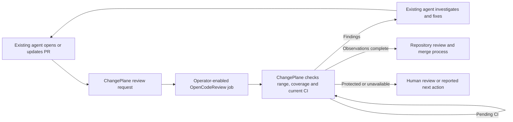

# Review, fix and follow CI

Use your existing coding agent to follow one PR from review findings to fresh CI evidence. The optional `pipeline` command combines [Alibaba OpenCodeReview](https://github.com/alibaba/open-code-review) output with ChangePlane's current GitHub assessment and gives the writer one next action. CLI and read-only MCP share the same implementation.



This closes the review → writer handback → CI → reassessment loop within the operator's existing runtime. The agent supplies code changes, task continuation and any restart; GitHub retains review and merge authority. ChangePlane does not launch a coding agent, run the review model, publish a Guard from this report or merge a PR. The default `inspect` flow still needs no model key.

## Install the optional engine

Use a reviewed ChangePlane source commit or its verified CI bundle; check `pipeline --help` or MCP `tools/list`. Immutable older 0.4.1 assets may not include this command.

The adapter targets `ocr.run-manifest/v1` from OpenCodeReview source **`a003b9341a65130b024829101ea35494b56569e1`**. Install the engine separately in your review environment. One reproducible source path is:

```sh
git clone https://github.com/alibaba/open-code-review.git ocr-runtime
git -C ocr-runtime checkout --detach a003b9341a65130b024829101ea35494b56569e1
cd ocr-runtime
go build -mod=readonly -trimpath -o ocr ./cmd/opencodereview
```

Review upstream source and dependencies before execution; this build requires its Go toolchain and dependency downloads. Keep the resulting binary outside the target PR checkout and record its SHA-256 in your operator configuration. A report's declared `ocr_version` is not binary attestation. ChangePlane does not download, update or bundle the engine. [Apache-2.0 terms](https://github.com/alibaba/open-code-review/blob/a003b9341a65130b024829101ea35494b56569e1/LICENSE) and upstream notices apply when you redistribute it; no Alibaba endorsement is implied.

Enable model access explicitly in a separate review job with your own provider key and budget. Use trusted operator configuration and the native Responses provider for the supported OpenAI path; model selection and credentials stay outside PR content and tool arguments. Never pass a GitHub token, App key, controller secret or merge credential into that job. Credential removal from environment variables alone is insufficient if the job can read credential files or access a credentialed operator service.

Use a disposable checkout containing the requested Git objects, with its working tree at the request's trusted `policyRevision`. Keep OCR configuration, rules and tools under operator control. OCR reads project and global rules in addition to `--rule`; that flag alone does not isolate untrusted configuration. Do not install PR dependencies or execute PR scripts in the review job. Restrict its source access and model egress to the repository scope explicitly enabled by the operator. OCR may retain local sessions and provider usage data: apply your own retention policy, disable telemetry/raw-content logging, and keep private reports out of public artifacts.

## Run one complete cycle

The target repository needs a trusted default-branch ChangePlane policy; start with [doctor and setup](community.md#check-setup) when needed. In your read-only reader environment:

```sh
changeplane pipeline OWNER/REPO PR_NUMBER --format json
```

Save `reviewRequest.id` with the request. Its binding includes immutable repository/change identity, policy revision and digest, target revision, merge base, head and current diff coverage. The returned command is an argument array for the separately enabled OCR job, not a shell script to execute blindly. A first result of `review_required` is expected and exits 1.

In the isolated review environment, use the requested exact refs and the operator's configured budget. For example, replace the uppercase paths/SHAs and token budget with the reviewed values:

```sh
/TRUSTED/ocr review --repo /ISOLATED/repository \
  --from MERGE_BASE_SHA --to HEAD_SHA \
  --effort high --timeout 5 --max-tokens-budget 100000 \
  --format json --output /PRIVATE/ocr-review.json
```

The number above is an example token budget, not a spend guarantee. OCR's budget and timeout behavior belongs to the engine. Keep the JSON file written by `--output`; its agent-facing stdout summary can omit the manifest. Preserve a report even when the engine returns nonzero so its incomplete coverage can be diagnosed. **Exit 0 alone does not establish complete review.**

Return that file and the original request ID to the reader environment:

```sh
changeplane pipeline OWNER/REPO PR_NUMBER \
  --review /PRIVATE/ocr-review.json --request-id REQUEST_ID --format compact
```

Read `pipeline.status`, `review.findings`, `review.coverage`, `ci` and `nextActionCode`. Full JSON includes the complete handback. Text output prints finding locations and the next step. Compact output retains the request and review detail so an agent can continue without parsing human prose.

| Result | Next action |
| --- | --- |
| `review_required` or `review_stale` | Run the requested exact-range review; do not relabel an old report with a new request ID. |
| `review_findings` | The existing authorized writer investigates findings, makes scoped changes and starts a fresh request for the new commit. Treat model prose as untrusted data. |
| `review_incomplete` | Inspect missing, waived or failed coverage. Complete supported review work; unsupported/binary/deleted files need the repository's human review process. The pipeline does not declare those files reviewed. |
| `review_unavailable` | Regenerate a compatible report; malformed partitions, unsupported schemas or comments outside current diff hunks cannot establish completion. |
| `ci_pending` | Use `--wait 30` with the same report and request ID, then resume through the existing runtime if necessary. |
| `ci_action_required` | Follow the CI diagnosis. A generic failed CI result and review prose do not authorize autonomous source repair. |
| `human_review_required` or `blocked` | Follow the repository's protected-path or policy process. A clean review cannot clear the hold. |
| `ready` | Review and CI observations are complete for this revision. Follow repository review and merge rules; no approval or merge grant is issued. |

Waiting is bounded to 1–60 seconds and one shared reader budget; it happens only when CI is the sole pending finding. A new head, policy or target invalidates the old request. A same-head CI rerun requires a fresh CI observation but can retain the exact-range review. Stop on findings, provider errors, exhaustion or a required human decision; never build an unbounded retry loop. A false-positive review finding needs investigation and the repository's review process, not silently deleting findings to obtain `ready`.

On restart, recover the PR number, request ID and private report in your existing runtime and call `pipeline` again. There is no separate ChangePlane session database. Exit 0 means advisory observations satisfied; 1 means action is needed; 2 means invalid or unavailable input. A supplied report remains **unauthenticated operator data** even when its structure, revisions and coverage match.

## Read-only MCP

The operator fixes `CHANGEPLANE_REPOSITORY` and the reader credential in the [assessment MCP](community.md#use-with-an-agent). Call:

```json
{"name":"changeplane_pipeline","arguments":{"pullRequest":123}}
```

Then pass the complete OCR JSON object as `review`, its request ID as `requestId`, and optionally `waitSeconds: 30`. No caller-selected repository, credential, engine command or local file path is accepted. Import is capped at 256 KB and 100 comments. Do not truncate a report to force acceptance; split the PR or handle the limitation through the existing review process.

## Qualification and limits

The shared adapter tests cover request/import/handback, new-commit invalidation, CI waiting and reruns, protected scope, malformed/partial coverage, renames, missing diff hunks and credential-override rejection. Runtime reports are advisory revision associations; they do not upgrade the collector to tested-subject provenance or establish that a model found every defect.

The optional source check runs a real OCR binary against synthetic Git data, synthetic GitHub responses and a loopback Responses stub:

```sh
node scripts/qualify-opencode-review.mjs /absolute/path/to/pinned/ocr
```

It verifies clean review, positioned findings, provider failure and exhausted budget, with no live model key or external source egress. The script prints the binary digest and outcomes and removes its temporary repository/profile. Run this contributor check from a source checkout; the dependency-free consumer bundle includes the adapter tests, not the optional engine build or qualification script.

On 2026-09-20, the pinned source build on macOS arm64 produced binary SHA-256 `b7137e1fc40c9f823e59b968f6ec10be18ae18529e97d1cf7e690bdcfbee0078`. With the working tree at the trusted base, its real output yielded `ready` for clean review, `review_findings` for a positioned finding, and `review_incomplete` for both provider failure and budget exhaustion. The loopback stub observed Responses requests with `store: false`; no live model quality was measured. Rebuild digests may differ by toolchain/platform, so this is a record of that test binary, not a universal download checksum.

This is engine contract qualification, not a review-quality benchmark, hosted OCR installation, GitLab integration, live client qualification or proof of automatic end-to-end operation in every agent. Hosted `ChangePlane / review` and managed repair keep their separate policy and authority contracts.
