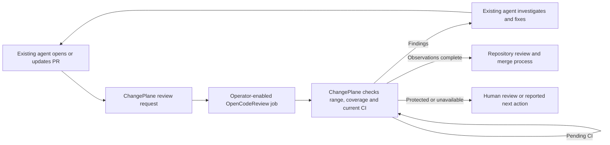

# Review, fix and follow CI

Use your existing coding agent to follow one PR from review findings to fresh CI evidence. The optional `pipeline` command combines [Alibaba OpenCodeReview](https://github.com/alibaba/open-code-review) output with ChangePlane's current GitHub assessment and gives the writer one next action. CLI and MCP share assessment logic. Optional local continuation and model execution are separate, explicitly enabled capabilities.



This closes the review → writer handback → CI → reassessment loop within the operator's existing runtime. The agent supplies code changes, task continuation and any restart; GitHub retains review and merge authority. ChangePlane does not launch a coding agent, run the review model, publish a Guard from this report or merge a PR. The default `inspect` flow still needs no model key.

## Install the optional engine

Use a reviewed ChangePlane source commit or its verified CI bundle; check `pipeline --help` or MCP `tools/list`. Immutable older 0.4.1 assets may not include this command.

The adapter targets `ocr.run-manifest/v1` from OpenCodeReview source **`a003b9341a65130b024829101ea35494b56569e1`**. Install the engine separately in your review environment. One reproducible source path is:

```sh
git clone https://github.com/alibaba/open-code-review.git ocr-runtime
git -C ocr-runtime checkout --detach a003b9341a65130b024829101ea35494b56569e1
cd ocr-runtime
go build -mod=readonly -trimpath -o ocr ./cmd/opencodereview
```

Review upstream source and dependencies before execution; this build requires its Go toolchain and dependency downloads. Keep the resulting binary outside the target PR checkout and record its SHA-256 in your operator configuration. A report's declared `ocr_version` is not binary attestation. The dependency-free core does not bundle the engine; the optional local runner uses an operator-built image. [Apache-2.0 terms](https://github.com/alibaba/open-code-review/blob/a003b9341a65130b024829101ea35494b56569e1/LICENSE) and upstream notices apply when you redistribute it; no Alibaba endorsement is implied.

Enable model access explicitly in a separate review job with your own provider key and budget. Use trusted operator configuration and the native Responses provider for the supported OpenAI path; model selection and credentials stay outside PR content and tool arguments. Never pass a GitHub token, App key, controller secret or merge credential into that job. Credential removal from environment variables alone is insufficient if the job can read credential files or access a credentialed operator service.

Use a disposable checkout containing the requested Git objects, with its working tree at the request's trusted `policyRevision`. Keep OCR configuration, rules and tools under operator control. OCR reads project and global rules in addition to `--rule`; that flag alone does not isolate untrusted configuration. Do not install PR dependencies or execute PR scripts in the review job. Restrict its source access and model egress to the repository scope explicitly enabled by the operator. OCR may retain local sessions and provider usage data: apply your own retention policy, disable telemetry/raw-content logging, and keep private reports out of public artifacts.

## Follow and resume a PR

Start with [doctor and setup](community.md#check-setup), then let your existing agent run:

```sh
changeplane follow OWNER/REPO PR_NUMBER --format compact
```

`follow` creates a private local session under `~/.local/state/changeplane` (or the operator's absolute `CHANGEPLANE_STATE_DIR`). It saves the request, imports an available job receipt, and reads current GitHub evidence on every call. Repeat the same command after closing your agent, a human review or CI progress. A new head, policy or target invalidates old review. The saved result is never treated as current evidence by itself.

There is no database, daemon or automatic wakeup. On Unix the state directory must be private (0700); reports are written atomically with 0600 permissions. A per-PR lock prevents two consumers from starting the same review together. After a forced process kill, stop any surviving job before removing its stranded lock. Delete a stopped session's directory to forget its reports; reports may contain private code or finding text and belong in your own retention policy.

### Enable automatic review once

The agent or operator builds the reviewed engine into a **local** Docker image once. Docker must be running and the source checkout must contain the requested head, merge base and trusted policy commit. Use the source pin above, export only its committed files into a new directory, then build with [the image recipe](../examples/opencode-review.Dockerfile):

```sh
mkdir ocr-source
# Run against the reviewed checkout above; git archive excludes local credentials and untracked files.
git -C ocr-runtime archive a003b9341a65130b024829101ea35494b56569e1 | tar -xf - -C ocr-source
docker build -f /ABSOLUTE/changeplane-runtime/examples/opencode-review.Dockerfile -t changeplane-ocr:local ocr-source
docker image inspect changeplane-ocr:local --format '{{.Id}}'
```

Build inputs include the pinned upstream source plus the recipe's base images and Go dependencies. This recipe is for an operator-reviewed local build, not a signed prebuilt distribution. Record the returned immutable image ID; the runner also checks its OCR source label. The label is an operator declaration, not third-party attestation. Retain upstream licenses and dependency notices if redistributing your image.

In the **operator environment**, set `CHANGEPLANE_REVIEW_IMAGE` to that `sha256:...` ID, `CHANGEPLANE_REVIEW_REPOSITORY` to your local target repository, and supply `OPENAI_API_KEY` through your secret manager. Model calls need explicit operator consent and the operator's budget. `CHANGEPLANE_REVIEW_MODEL` defaults to `gpt-5.6-luna`; `gpt-5.6-terra` and `gpt-5.6-sol` are the supported alternatives. Keys never belong in chat, CLI arguments or committed configuration.

Then the existing agent uses one command:

```sh
changeplane follow OWNER/REPO PR_NUMBER --run-review --format compact
```

The runner materializes exact Git commits/trees and blobs for changed/renamed paths only. Unrelated blobs, credential files, remotes and checkout hooks are absent. The working tree uses the trusted policy revision; project OCR rules are excluded so engine defaults stay under operator-image control. It does not install or execute PR code. Preparation is bounded to 500 PR ancestry commits, 50,000 tree entries per snapshot, 512 KB per source blob and 16 MB copied objects; unavailable objects or excess scope require narrowing the PR or using the existing isolated-job path.

The OCR container has no network and no model/GitHub key. It reaches a separate fixed-destination Responses proxy through a private Docker volume socket. The proxy receives the operator key on stdin, calls only the native OpenAI Responses endpoint with `store: false` and high reasoning effort, and rejects hosted tools. It accepts at most 24 requests, bounds each input to 512 KB and output to 4,096 tokens, and stops further calls once reported usage reaches 100,000 tokens. An in-flight request may cross that usage threshold; this is a bounded execution policy, **not a dollar-spend guarantee**. OCR runs one subtask at a time, keeps unfiltered findings for explicit adjudication, and also receives a five-minute timeout and 100,000-token budget. The controller stops the job after 330 seconds and cleans temporary containers, sockets and source files.

The report is imported and saved automatically before a fresh GitHub assessment. Repeating `--run-review` reuses the current report and does not start a duplicate model call. A provider failure or exhausted budget remains incomplete. After investigating, use `follow OWNER/REPO PR --run-review --retry-review` for an explicit retry; the private session permits at most two runner invocations per request, including interrupted attempts. A complete report or findings needing fixes cannot be rerun through that flag. MCP exposes the same option as `retryIncomplete` on the operator-enabled review tool. After exhaustion, investigate and stop any surviving job before deliberately replacing the private session. Docker/source/configuration failures return a specific setup action; read-only `inspect` remains available. Ctrl-C or stopping the agent task cancels the local runner. Keep client timeouts long enough for model review, or use the CLI from the existing agent runtime.

The website, ChatGPT tools and CLI presentation identify the responsible role, current revision and next action. Display grouping retains every original finding ID; it never dismisses a finding or improves reported coverage. Measure usefulness with the offline [review-quality report](review-quality.md), retaining incomplete, unresolved and missed-defect cases.

### Use an existing isolated review job

`pipeline` remains stateless and read-only. `follow` also returns `session.requestPath` and `session.resultPath`. Your existing isolated job can read the request, run the pinned engine with trusted configuration and write this bounded receipt to the result path:

```json
{"requestId":"THE_REQUEST_ID","review":{"status":"...","manifest":{},"comments":[]}}
```

`review` must be the complete JSON file written by OCR `--output`, not its stdout summary. Write the receipt atomically in the private session directory. The next `follow` imports it automatically. The actual v1 manifest is required; this is only the envelope shape. Reader credentials stay outside the review job. Receipt contents remain unauthenticated operator data and never establish approval or merge authority.

For a one-off stateless import, use `pipeline OWNER/REPO PR_NUMBER --review FILE --request-id ID`. All paths share the same coverage validation. Import is capped at 256 KB and 100 comments. Exit 0 alone from the engine does not establish complete review; do not truncate a report to force acceptance.

## Resolve human review without losing the pipeline

Read `humanReview.reviewUrl` and the private `session.humanReviewPath` draft (or `humanReview.reviewBody` in stateless output). A human repository writer reviews the listed protected/unsupported paths and each suspected false positive, removes any finding that needs a fix, replaces each placeholder with their reason, and submits the body as a GitHub **Approve** review for that exact head. A personal repository owner who authored the PR can instead submit **Comment** in the native review form; this is recorded as an advisory owner decision (`selfReview: true`), not a GitHub approval. The agent never submits that approval on the human's behalf.

Repeat `follow`. The collector reads [native PR reviews](https://docs.github.com/en/rest/pulls/reviews#list-reviews-for-a-pull-request) and [current repository permission](https://docs.github.com/en/rest/collaborators/collaborators#get-repository-permissions-for-a-user) twice. An independent `User` with write/maintain/admin permission can resolve these advisory holds through an Approve review. The explicit Comment-review exception also verifies that the author owns the personal repository; organization authors and ordinary comments do not qualify. The current head, request ID (including policy/target/diff) and report digest must match. Bot, stale, dismissed, malformed and read-only reviewer decisions do not count. An active changes-requested review retains a hold. Reading this evidence needs Pull requests and Metadata read access; missing permissions fail closed.

Human decisions can resolve protected-path holds, individual false positives and explicitly reviewed missing/waived files. They cannot turn provider failure, malformed output, exhausted budget, blocked paths or failed CI into success. The original engine coverage, findings and `ci` report stay visible; human coverage is reported separately. This does not satisfy or alter GitHub branch protection, CODEOWNERS, Guard or merge requirements.

| Result | Next action |
| --- | --- |
| `review_required` or `review_stale` | Run the enabled review for the fresh request. |
| `review_findings` | Existing authorized writer investigates and fixes, or asks the human to adjudicate specific false positives. |
| `review_incomplete` | Inspect coverage. Unsupported files can receive exact-revision human review; provider/budget failures need a deliberate rerun. |
| `review_unavailable` | Regenerate a compatible report; malformed or out-of-diff findings cannot establish completion. |
| `ci_pending` | Repeat `follow --wait 30`; the stored current report is reused. |
| `ci_action_required` | Follow the CI diagnosis. A generic CI failure is not source-repair authorization. |
| `human_review_required` | Give the human the review link and draft, then reassess their actual GitHub review. |
| `blocked` | Follow repository policy; a review cannot override blocked scope. |
| `ready` | Combined advisory observations are complete. Follow the existing repository review/merge process. |

Waiting is bounded to 1–60 seconds and one collection budget. Stop on actionable findings, provider errors, exhaustion or a required human decision. `UNAVAILABLE` is not completion. No result grants source-write, Guard or merge authority.

## MCP

The default [assessment MCP](community.md#use-with-an-agent) still exposes read-only `changeplane_pipeline` with the PR number, optional raw `review`/`requestId`, and `waitSeconds`. MCP bounds each frame separately to 512 KB, so a supported 256 KB report plus envelope fits. Oversized/malformed frames get JSON-RPC errors without terminating the connection.

Setting the operator's absolute `CHANGEPLANE_STATE_DIR` additionally exposes **`changeplane_follow`**. It writes private local state and accepts only `pullRequest` and optional `waitSeconds`. Setting **`CHANGEPLANE_ENABLE_REVIEW=1`** additionally exposes **`changeplane_run_review`**, which accepts only `pullRequest` and uses the operator's image, source and BYOK configuration above. Its annotation declares local mutation and model cost; it is never advertised as read-only. Callers cannot override repository, filesystem paths, executable, credentials or model. Unset these variables to return to read-only tools.

## Qualification and limits

The shared adapter tests cover request/import/handback, new-commit invalidation, CI waiting and reruns, protected scope, malformed/partial coverage, renames, missing diff hunks and credential-override rejection. Runtime reports are advisory revision associations; they do not upgrade the collector to tested-subject provenance or establish that a model found every defect.

The optional source check runs a real OCR binary against synthetic Git data, synthetic GitHub responses and a loopback Responses stub:

```sh
node scripts/qualify-opencode-review.mjs /absolute/path/to/pinned/ocr
```

It verifies clean review, positioned findings, provider failure and exhausted budget, with no live model key or external source egress. The script prints the binary digest and outcomes and removes its temporary repository/profile. Run this contributor check from a source checkout; the dependency-free consumer bundle includes the adapter tests, not the optional engine build or qualification script.

On 2026-09-20, the pinned source build on macOS arm64 produced binary SHA-256 `b7137e1fc40c9f823e59b968f6ec10be18ae18529e97d1cf7e690bdcfbee0078`. With the working tree at the trusted base, its real output yielded `ready` for clean review, `review_findings` for a positioned finding, and `review_incomplete` for both provider failure and budget exhaustion. The loopback stub observed Responses requests with `store: false`; no live model quality was measured. Rebuild digests may differ by toolchain/platform, so this is a record of that test binary, not a universal download checksum.

This is engine contract qualification, not a review-quality benchmark, hosted OCR installation, GitLab integration, live client qualification or proof of automatic end-to-end operation in every agent. Hosted `ChangePlane / review` and managed repair keep their separate policy and authority contracts.

The isolated Docker runner was also qualified on 2026-09-20 using a locally built Linux arm64 image (`sha256:6a89782a61315b44657970cbc9a2b8fe77b453d8c34dab94f5f7daa1e6808cc0`). The real OCR process accessed a Responses stub through the private volume socket with engine networking disabled; clean/finding/provider-failure/budget outcomes matched the pipeline contract. The stub checked high reasoning effort and `store: false`. This is local container/contract qualification, not a real-provider or cross-platform Docker claim. Repeat with `node scripts/qualify-opencode-review.mjs sha256:YOUR_LOCAL_IMAGE_ID`.
